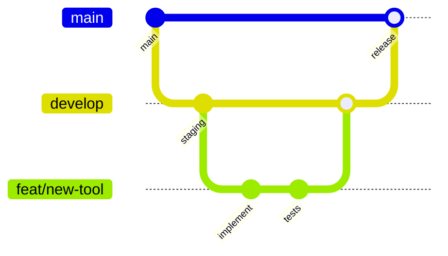

# Contributing to Toolspace

Welcome! This guide will help you contribute effectively to the Toolspace project.

## Branching Model

### Branch Types

- `feat/*` - New features
- `fix/*` - Bug fixes
- `docs/*` - Documentation updates
- `ops/*` - Operations/infrastructure changes
- `test/*` - Test improvements

### Workflow



## Commit Style

We use [Conventional Commits](https://www.conventionalcommits.org/):

```bash
type(scope): description

# Examples:
feat(tools): add batch QR code generator
fix(billing): resolve checkout session timeout
docs(setup): update Firebase configuration guide
ops(ci): add production deployment workflow
```

### Types

- `feat` - New feature
- `fix` - Bug fix
- `docs` - Documentation
- `style` - Code style (no logic change)
- `refactor` - Code refactoring
- `test` - Add/update tests
- `ops` - Operations/deployment
- `perf` - Performance improvement

## Development Setup

### Prerequisites

- Flutter 3.24.0+
- Node.js 20+
- Firebase CLI
- Git

### Local Setup

```bash
# Clone repository
git clone https://github.com/bitquan/toolspace.git
cd toolspace

# Install dependencies
flutter pub get
cd functions && npm ci && cd ..

# Start development
flutter run -d chrome
```

## Code Standards

### Dart/Flutter

```bash
# Format code
dart format .

# Analyze code
flutter analyze

# Run tests
flutter test
```

**Rules:**

- Use `dart format` (no custom formatting)
- Follow [Effective Dart](https://dart.dev/guides/language/effective-dart)
- Prefer `const` constructors
- Use meaningful variable names
- Add documentation for public APIs

### TypeScript

```bash
# Lint and format
npm run lint

# Type check
npm run build

# Run tests
npm test
```

**Rules:**

- Use ESLint Google config
- Prefer `const` over `let`
- Use strict TypeScript mode
- Export interfaces for public APIs

## Testing Requirements

### Test Pyramid

1. **Unit Tests** (70%) - Logic and utilities
2. **Widget Tests** (20%) - UI components
3. **Integration Tests** (10%) - E2E flows

### Required Tests

Before submitting PR:

```bash
# Flutter tests
flutter test --coverage

# Functions tests
cd functions && npm test

# Security tests
npm run test:rules
```

## Required Checks

### Preflight (Local)

Run before pushing:

```bash
# Full preflight check
./scripts/preflight.sh

# Or manually:
dart format . --set-exit-if-changed
flutter analyze
flutter test
cd functions && npm run qa
```

### PR CI

Automated checks on every PR:

- ✅ Code formatting
- ✅ Static analysis
- ✅ Unit tests
- ✅ Security rules tests
- ✅ Build validation

## Pull Request Process

### 1. Create PR

Use the PR template (auto-populated). Fill out:

- **Description**: What changed and why
- **Testing**: How you verified the changes
- **Screenshots**: For UI changes
- **Breaking Changes**: Any API changes

### 2. Review Requirements

- **Code Review**: 1+ approvals required
- **All Checks Pass**: CI must be green
- **Up to Date**: Branch must be current with target

### 3. Merge Requirements

- Use **"Squash and merge"** for feature branches
- Use **"Create merge commit"** for release branches
- Delete branch after merge

## Feature Flags

For risky or gradual rollouts:

```yaml
# config/feature-flags.yml
features:
  new_billing_flow:
    enabled: false
    description: "New Stripe checkout flow"
```

```dart
// Usage
if (FeatureFlags.isEnabled('new_billing_flow')) {
  // New implementation
} else {
  // Fallback
}
```

## Security Guidelines

### Sensitive Data

- **Never commit secrets** (use GitHub Secrets)
- **Use environment variables** for configuration
- **Sanitize user inputs** in all functions
- **Validate permissions** on every API call

### Firestore Rules

Test security rules:

```bash
cd functions
npm run test:rules
```

## Documentation

### When to Update Docs

- New features → Update relevant tool docs
- API changes → Update `docs/backend/API.md`
- Setup changes → Update setup guides
- Breaking changes → Update `CHANGELOG.md`

### Documentation Style

- Use clear, concise language
- Include code examples
- Add screenshots for UI changes
- Link related documentation

## Release Process

### Version Numbers

Follow [Semantic Versioning](https://semver.org/):

- `MAJOR.MINOR.PATCH`
- `1.0.0` - Initial release
- `1.1.0` - New features
- `1.0.1` - Bug fixes

### Release Checklist

1. Create `release/vX.Y.Z` branch
2. Update versions and changelog
3. Merge to `develop` for staging
4. Merge to `main` for production
5. Tag release `vX.Y.Z`

## Getting Help

### Questions

- **GitHub Discussions** - General questions
- **GitHub Issues** - Bug reports and feature requests
- **Code Review** - Tag specific reviewers

### Common Issues

See `docs/development/debugging.md` for troubleshooting guide.

## Recognition

Contributors will be recognized in:

- Release notes
- `CONTRIBUTORS.md` file
- Special mentions for significant contributions

---

Thank you for contributing to Toolspace! 🚀
