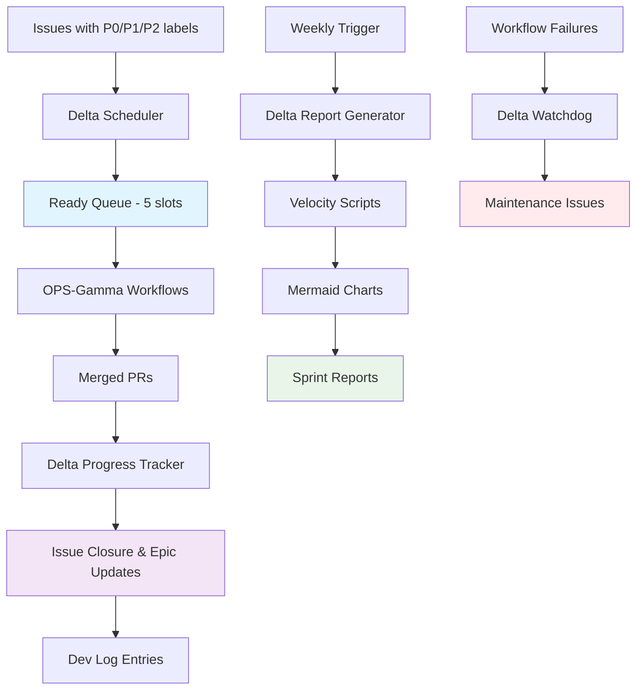

# OPS-Delta: Adaptive Sprint Management System

**Version:** 1.0
**Status:** Production Ready
**Dependencies:** OPS-Gamma Autonomous Workflows

## Overview

OPS-Delta is a comprehensive adaptive sprint management system that automatically organizes work, tracks progress, and generates reports with velocity charts. It extends the OPS-Gamma autonomous workflow system to create a fully self-managing development environment.

## Core Features

- **🤖 Automated Sprint Scheduling** - Daily evaluation and queue management
- **📊 Progress Tracking** - Automatic issue closure and Epic updates
- **📈 Velocity Charts** - Mermaid-based reporting with metrics
- **🔍 Self-Healing Watchdog** - Monitors and maintains system health
- **⚡ Zero Manual Intervention** - Fully autonomous operation

## System Architecture



## Workflows

### 1. Delta Scheduler (`delta-scheduler.yml`)

**Trigger:** Daily at 2 PM UTC + Manual dispatch
**Purpose:** Maintain ready queue and schedule work automatically

#### What it does:

- Ensures current sprint milestone exists (Sprint-YYMM-W## format)
- Maintains ready queue at exactly 5 open issues
- Selects highest-priority issues (P0-blocker → P1 → P2)
- Sorts by shortest estimate within priority groups
- Adds selected issues to current sprint milestone
- Writes audit log to Sprint Epic (if exists)

#### Configuration:

```yaml
# Default behavior (customizable via workflow_dispatch)
ready_queue_target: 5
sprint_naming: "Sprint-YYMM-W##"  # ISO week based
priority_order: ["P0-blocker", "P1", "P2"]
estimate_parsing: "estimate: X.Xd" or "est:X.Xd" label
```

#### Safety Features:

- **Dry run by default** - Must explicitly set `dry_run: false`
- **Idempotent operation** - Safe to run multiple times
- **Overflow protection** - Removes ready labels from excess issues

### 2. Delta Progress Tracker (`delta-progress.yml`)

**Trigger:** PR merged + Manual dispatch
**Purpose:** Track completed work and update progress indicators

#### What it does:

- Parses "Closes #NNN" patterns from merged PR bodies
- Closes referenced issues automatically
- Removes `ready` labels and adds `done` labels
- Updates Epic comments with checkmark progress
- Creates dev-log entries in `dev-log/operations/`
- Generates completion audit trail

#### Integration:

- Triggered automatically by OPS-Gamma auto-merge workflow
- Works with any PR that follows "Closes #123" convention
- Updates milestone progress automatically

### 3. Delta Report Generator (`delta-report.yml`)

**Trigger:** Mondays at 12:00 UTC + Manual dispatch
**Purpose:** Generate comprehensive sprint reports with velocity analytics

#### What it generates:

- **Velocity Charts** (Mermaid bar charts showing issues/points per week)
- **What Shipped** (completed issues with metrics)
- **In Progress** (ready queue + planned items)
- **Next Up** (top 10 backlog by priority/estimate)
- **Sprint Metrics** (velocity, health, tool distribution)

#### Output Locations:

- `docs/reports/sprint-summary.md` (current report, overwrites)
- `docs/reports/history/YYYY-WW.md` (weekly archives)

#### Sample Report Structure:

````markdown
# Sprint Summary - Week 2025-41

**Sprint:** Sprint-2510-W41
**Generated:** 2025-10-06
**Period:** 2025-09-29 to 2025-10-06

## 📈 Velocity Trends

```mermaid
bar chart
  title Velocity (Issues/Points)
  x-axis [W38,W39,W40,W41]
  y-axis "Count"
  "Completed Issues" [3,5,4,6]
  "Completed Points" [2.5,4.0,3.5,5.0]
```
````

## 🚢 What Shipped

...

```

### 4. Delta Watchdog (`delta-watchdog.yml`)

**Trigger:** Delta workflow completion + Manual dispatch
**Purpose:** Monitor system health and create maintenance issues

#### What it monitors:
- **Consecutive failures** (2+ triggers maintenance issue)
- **Workflow availability** and recent run history
- **API rate limits** and permission issues
- **Script execution** errors

#### Auto-remediation:
- Creates **P1 maintenance issues** with diagnostic info
- Updates existing issues rather than creating duplicates
- Provides troubleshooting steps and run URLs
- Tracks failure patterns over time

## Conventions & Standards

### Sprint Naming
**Format:** `Sprint-YYMM-W##`
- `YY` = Year (2-digit)
- `MM` = Month (2-digit, zero-padded)
- `W##` = ISO Week number (zero-padded)
- **Example:** `Sprint-2510-W41` (October 2025, Week 41)

### Issue Labeling
**Required labels for backlog intake:**
- `P0-blocker` - Critical blocking issues
- `P1` - High priority
- `P2` - Medium priority

**System labels (auto-managed):**
- `ready` - In active ready queue (5 max)
- `done` - Completed and merged
- `ops-delta` - System-managed items

**Estimate format:**
- In issue body: `Estimate: 2.5d`
- As label: `est:2.5d`
- Default: 1.0 day if not specified

### Milestone Management
- **Auto-created** by scheduler using ISO week calculation
- **One active sprint** at a time
- **Automatic assignment** when issues enter ready queue
- **No manual intervention** required

### Ready Queue Rules
- **Target size:** 5 open issues at all times
- **Priority-first selection:** P0 → P1 → P2
- **Estimate tiebreaker:** Shorter estimates preferred
- **Automatic overflow** management (removes excess ready labels)

## File Locations

### Workflows
```

.github/workflows/
├── delta-scheduler.yml # Daily sprint scheduling
├── delta-progress.yml # PR merge progress tracking
├── delta-report.yml # Weekly report generation
└── delta-watchdog.yml # System health monitoring

```

### Scripts
```

scripts/
├── utils.mjs # Common utilities & GitHub API helpers
├── velocity.mjs # Velocity calculation & Mermaid charts
└── report.mjs # Sprint report generation

```

### Documentation & Reports
```

docs/
├── automation/
│ └── ops-delta.md # This file
└── reports/
├── sprint-summary.md # Current sprint report (overwrites)
└── history/ # Weekly report archives
├── 2025-40.md
├── 2025-41.md
└── ...

```

### Dev Logs
```

dev-log/
└── operations/
├── 2025-10-06T14-30-15-delta-progress.md
├── 2025-10-06T09-15-22-delta-progress.md
└── ...

````

## Usage Instructions

### Getting Started

1. **Prerequisites:**
   - OPS-Gamma workflows must be installed and functional
   - Issues should have P0/P1/P2 priority labels
   - Estimates should follow `Estimate: X.Xd` format

2. **Initial Setup:**
   ```bash
   # Test scheduler in dry-run mode
   gh workflow run delta-scheduler.yml -f dry_run=true

   # Check health
   gh workflow run delta-watchdog.yml -f dry_run=true

   # Generate test report
   gh workflow run delta-report.yml -f dry_run=true
````

3. **Go Live:**

   ```bash
   # Enable live scheduling
   gh workflow run delta-scheduler.yml -f dry_run=false

   # Reports and progress tracking activate automatically
   ```

### Daily Operations

**The system runs autonomously:**

- **Scheduler** runs daily at 2 PM UTC
- **Progress tracker** triggers on every PR merge
- **Reports** generate weekly on Mondays at 12 PM UTC
- **Watchdog** monitors after each workflow run

**Manual triggers (if needed):**

```bash
# Force scheduler run
gh workflow run delta-scheduler.yml -f dry_run=false

# Generate immediate report
gh workflow run delta-report.yml -f dry_run=false

# Check system health
gh workflow run delta-watchdog.yml -f dry_run=true

# Process specific PR manually
gh workflow run delta-progress.yml -f dry_run=false -f pr_number=123
```

### Monitoring & Maintenance

**Check system health:**

- Review `docs/reports/sprint-summary.md` weekly
- Monitor for P1 maintenance issues created by watchdog
- Verify ready queue size stays at 5

**Troubleshooting:**

1. **Scheduler not working?** Check GitHub token permissions
2. **No velocity data?** Ensure issues have `done` labels when merged
3. **Reports missing?** Verify `docs/reports/` directory permissions
4. **Script errors?** Check Node.js dependencies in workflow

## Advanced Configuration

### Customizing Scheduler Behavior

**Ready queue size:**
Edit `delta-scheduler.yml`, line ~87:

```javascript
const targetReady = 5; // Change to desired queue size
```

**Priority weights:**
Edit priority selection logic in scheduler around line ~95:

```javascript
for (const priority of ["P0-blocker", "P1", "P2"]) {
  // Add or remove priority levels
}
```

### Customizing Reports

**Velocity timeframe:**
Edit `delta-report.yml`, change script call:

```bash
node scripts/velocity.mjs --since-days=42  # 6 weeks instead of 4
```

**Report frequency:**
Edit `delta-report.yml` cron schedule:

```yaml
schedule:
  - cron: "0 12 * * MON" # Change day/time as needed
```

### Extending Functionality

**Adding new metrics:**

1. Extend `scripts/utils.mjs` with new calculation functions
2. Update `scripts/velocity.mjs` to include new data
3. Modify report templates in `scripts/report.mjs`

**Custom notifications:**
Add Slack/Teams webhook calls to workflow completion steps

**Integration with external tools:**
Add API calls to project management tools in progress tracker

## Security & Permissions

### Required GitHub Permissions

```yaml
permissions:
  contents: write # For committing reports and dev logs
  issues: write # For managing issue labels and milestones
  pull-requests: read # For reading PR merge information
  actions: read # For watchdog monitoring
```

### Token Requirements

- Standard `GITHUB_TOKEN` is sufficient for all operations
- No additional secrets or personal access tokens required
- Workflows run with repository scope only

### Safety Features

- **Dry run defaults** on all manual triggers
- **Idempotent operations** - safe to run multiple times
- **Failure isolation** - one workflow failure doesn't break others
- **Audit logging** - all actions recorded in dev-log
- **Rollback capability** - manual labels can override automation

## Troubleshooting Guide

### Common Issues

**Q: Scheduler is selecting wrong issues**
A: Check priority labels (P0-blocker, P1, P2) and estimate format (`Estimate: X.Xd`)

**Q: Progress tracker not closing issues**
A: Ensure PR body contains `Closes #123` format and PR is actually merged

**Q: Reports missing velocity data**
A: Verify closed issues have `done` labels - only labeled issues count in velocity

**Q: Watchdog creating too many maintenance issues**
A: Review workflow failure patterns - may indicate systematic problems

**Q: Ready queue not maintaining 5 items**
A: Check backlog has sufficient P0/P1/P2 labeled issues available

### Diagnostic Commands

```bash
# Check recent workflow runs
gh run list --workflow=delta-scheduler.yml --limit=5

# View scheduler logs
gh run view --log [RUN_ID]

# List current ready queue
gh issue list --label=ready --state=open

# Check milestone status
gh api repos/:owner/:repo/milestones

# Verify issue labels
gh issue list --label=P1 --state=open --limit=10
```

### Recovery Procedures

**If scheduler is broken:**

1. Run with `dry_run=true` to see what it would do
2. Manually adjust ready labels if needed
3. Check GitHub API rate limits
4. Verify repository permissions

**If progress tracker is missing PRs:**

1. Run manually with specific PR number
2. Check PR body format for "Closes #123"
3. Verify issue exists and is open

**If reports fail:**

1. Check Node.js dependencies installation
2. Verify `docs/reports/` directory exists
3. Run scripts locally to debug errors

## Integration with OPS-Gamma

OPS-Delta extends and integrates with the existing OPS-Gamma autonomous workflows:

### Workflow Chain

```
OPS-Delta Scheduler → Ready Label Added
  ↓
OPS-Gamma Issue-to-Branch → Branch Created
  ↓
OPS-Gamma Branch-CI → Tests & Validation
  ↓
OPS-Gamma Auto-PR → Pull Request Created
  ↓
OPS-Gamma Auto-Merge → PR Merged (if tests pass)
  ↓
OPS-Delta Progress → Issue Closed, Epic Updated
  ↓
OPS-Delta Reports → Weekly Velocity Charts
```

### Shared Dependencies

- Same issue labeling system
- Shared milestone management
- Compatible branch naming conventions
- Integrated dev-log system

### Combined Benefits

- **Complete autonomy** from issue creation to reporting
- **Zero touch operations** for standard development workflow
- **Continuous optimization** through velocity tracking
- **Self-healing** via watchdog monitoring
- **Full audit trail** in dev-logs and reports

---

## Support & Maintenance

**System Version:** OPS-Delta 1.0
**Last Updated:** October 2025
**Maintainer:** Autonomous via OPS-Delta Watchdog

For issues or improvements:

1. Check existing P1 maintenance issues created by watchdog
2. Review recent workflow run logs for errors
3. Test changes in dry-run mode first
4. Update documentation when adding features

The system is designed to be self-maintaining through the watchdog workflow, but manual intervention may be needed for:

- Major GitHub API changes
- Repository permission updates
- New feature requirements
- Performance optimization

**Remember: All workflows default to dry-run mode for safety. Always test changes thoroughly before enabling live mode.**
