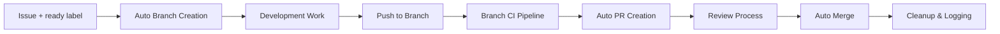

# 🤖 Autonomous Issue-Driven Workflow System

This repository implements a complete autonomous development workflow that transforms GitHub issues into fully automated development cycles. When you add a `ready` label to an issue, the system handles everything from branch creation to merge and documentation.

## 🚀 Quick Start

1. **Create or find an issue** you want to work on
2. **Add the `ready` label** to the issue
3. **Watch the magic happen**:
   - System creates branch: `feat/issue-123-your-feature`
   - You work on the branch, commit with issue references: `#123 Your commit`
   - Push triggers CI (tests, security, validation)
   - System auto-creates PR when CI passes
   - After review approval, system auto-merges
   - Issue closes, branch deletes, dev log updates

## 🏗️ Workflow Architecture



## 📋 Core Workflows

### 1. 🌿 Issue → Branch (`issue-to-branch.yml`)

**Trigger**: Issue labeled with `ready`

- Creates branch following `{type}/issue-{number}-{slug}` convention
- Detects branch type from issue labels (feat, fix, chore, docs)
- Adds helpful comments with development instructions
- Updates issue status to `in-progress`

### 2. 🧪 Branch CI (`branch-ci.yml`)

**Trigger**: Push to feature branches, PRs to main

- **Branch Validation**: Ensures proper naming convention
- **Test Suite**: Runs Flutter and Firebase Functions tests via reusable workflow
- **Security Scan**: Trivy vulnerability scanning
- **Status Reporting**: Comprehensive CI summaries

### 3. 🔄 Auto PR (`auto-pr.yml`)

**Trigger**: Push to feature branches after CI passes

- Waits for CI completion before creating PR
- Links to original issue automatically
- Generates descriptive PR content from commits
- Auto-assigns reviewers and appropriate labels
- Updates issue status to `review`

### 4. 🚀 PR Auto-Merge (`pr-merge.yml`)

**Trigger**: PR events, reviews, CI completion

**Safety Checks**:

- ✅ Approved by reviewers
- ✅ All CI checks passed
- ✅ No merge conflicts
- ✅ Auto-generated PR only

**Post-Merge Actions**:

- Closes linked issues
- Deletes feature branch
- Triggers dev log update

### 5. 🚦 Policy Checks (`policy-checks.yml`)

**Trigger**: All PRs and pushes

**Validates**:

- Branch naming: `{feat|fix|chore|docs}/issue-###-description`
- Commit messages: Must reference issues (`#123` or `fixes #123`)
- PR requirements: Description, issue links, proper labels
- Documentation: Features should include doc updates

### 6. 📝 Dev Log Updater (`dev-log-updater.yml`)

**Trigger**: Post-merge, manual dispatch

- Auto-generates monthly development logs
- Tracks commits, file changes, and PR details
- Maintains project history automatically
- Updates indices and summaries

### 7. 🧪 Test Runner (`test-runner.yml`)

**Type**: Reusable workflow

- Configurable Flutter and Functions testing
- Coverage artifact upload
- Comprehensive logging and summaries
- Used by multiple workflows

## 🎯 Branch Naming Convention

The system enforces strict branch naming:

```
{type}/issue-{number}-{description}
```

**Types**:

- `feat/` - New features
- `fix/` - Bug fixes
- `chore/` - Maintenance tasks
- `docs/` - Documentation updates

**Examples**:

- `feat/issue-123-add-user-authentication`
- `fix/issue-456-login-validation-bug`
- `chore/issue-789-update-dependencies`
- `docs/issue-321-api-documentation`

## 📝 Commit Message Policy

All commits must reference the issue:

✅ **Valid formats**:

- `#123 Add user authentication system`
- `Fix login validation bug (#456)`
- `Closes #789: Update all dependencies`
- `Resolves #321 - Add API documentation`

❌ **Invalid**:

- `Add feature` (no issue reference)
- `Fix bug` (no issue number)

## 🏷️ Issue Labels

The system uses these labels for automation:

### Status Labels

- `ready` - Issue ready for development (triggers branch creation)
- `status: in-progress` - Development in progress
- `status: review` - PR created, awaiting review
- `status: completed` - Issue completed and merged

### Type Labels

- `type:feature` / `feat` - New functionality
- `type:fix` / `fix` - Bug fixes
- `type:chore` / `chore` - Maintenance
- `type:documentation` / `docs` - Documentation

### Auto-merge Labels

- `auto-generated` - PRs created by the system
- `auto-merge` - Enables automatic merging (optional)

## 🛡️ Safety Features

### Multiple Approval Gates

- Branch naming validation
- Commit message policy enforcement
- CI test requirements
- Review approval requirements
- Merge conflict prevention

### Comprehensive Logging

- All workflow steps logged to GitHub Actions
- Dev log auto-updated with change details
- Audit trail for all automated actions

### Rollback Capabilities

- Git history preserved for rollbacks
- Branch deletion can be recovered from Git
- Manual intervention always possible

## 🧪 Testing the System

### Option 1: Create a Test Issue

1. Go to Issues → New Issue
2. Use "Task" or "Feature request" template
3. Fill out the details
4. Add `ready` label
5. Watch the automation in Actions tab

### Option 2: Use Existing Roadmap

1. Check `docs/roadmap/phase-1.md`
2. Find tasks with `sprint: now`
3. Run roadmap-to-issues workflow
4. Add `ready` label to generated issues

### What to Expect

1. **Within 1 minute**: Branch created, issue commented
2. **After commits**: CI runs, status checks appear
3. **After CI passes**: PR auto-created
4. **After approval**: Auto-merge, cleanup, logging

## 🔧 Configuration

### Reviewer Assignment

Edit `.github/workflows/auto-pr.yml`:

```yaml
reviewers: ["bitquan"] # Add your GitHub usernames
```

### CI Timeout

Edit workflow timeout in any CI workflow:

```yaml
timeout_minutes: 20 # Adjust as needed
```

### Auto-merge Rules

Auto-merge only happens when:

- PR has `auto-generated` label
- All CI checks pass
- At least one approval
- No requested changes
- No merge conflicts

## 📊 Monitoring

### GitHub Actions Tab

- View all workflow runs
- Check CI status and logs
- Monitor automation health

### Dev Log

- `docs/dev-log/` - Monthly activity logs
- Automatic project history tracking
- Change summaries and metrics

### Issue/PR Comments

- Workflow bots provide status updates
- Error messages with troubleshooting
- Links and next steps

## 🚨 Troubleshooting

### Branch Not Created

- Check if issue has `ready` label
- Verify issue-to-branch workflow ran in Actions
- Look for error messages in workflow logs

### CI Failing

- Check branch naming convention
- Ensure commits reference the issue
- Verify tests pass locally

### PR Not Created

- Ensure CI passed completely
- Check auto-pr workflow in Actions
- Verify branch follows naming convention

### Auto-merge Not Working

- Ensure PR has required approval
- Check all CI checks passed
- Verify PR has `auto-generated` label
- Look for merge conflicts

### Manual Override

You can always:

- Create branches manually
- Create PRs manually
- Merge manually
- The system detects and adapts

## 🔮 Future Enhancements

- **Slack/Discord notifications** for major events
- **Deployment automation** for production releases
- **Metrics dashboard** for workflow analytics
- **Advanced merge strategies** for complex changes
- **AI-powered code review** integration

## 📋 Workflow Files Reference

- `.github/workflows/issue-to-branch.yml` - Branch creation automation
- `.github/workflows/branch-ci.yml` - Feature branch CI pipeline
- `.github/workflows/auto-pr.yml` - Automatic PR creation
- `.github/workflows/pr-merge.yml` - Auto-merge with safety checks
- `.github/workflows/policy-checks.yml` - Quality and convention enforcement
- `.github/workflows/dev-log-updater.yml` - Automatic documentation
- `.github/workflows/test-runner.yml` - Reusable test suite
- `.github/ISSUE_TEMPLATE/` - Enhanced issue templates

## 🎉 Success!

The autonomous workflow system is now live and ready to handle your development process. Simply add the `ready` label to any issue and watch the complete development cycle execute automatically!

---

**Need help?** Check the Actions tab for workflow logs, or create an issue with the `question` label.
