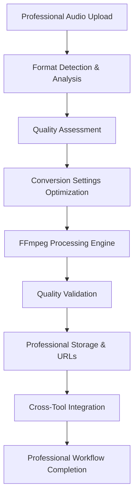

# Audio Converter - System Integration Architecture

**Last Updated**: October 11, 2025  
**Architecture Version**: 1.0  
**Integration Scope**: Cross-Tool Communication & Professional Media Processing

## Integration Overview

Audio Converter operates as a comprehensive media processing hub within the Toolspace ecosystem, seamlessly integrating with platform services, billing systems, and cross-tool workflows. The architecture emphasizes professional-grade audio processing capabilities, efficient data flow, and intelligent integration with complementary media tools for complete audio production workflow automation.

### Core Integration Principles

- **Professional Audio Processing**: FFmpeg-powered conversion engine for broadcast-quality results
- **Format Intelligence**: Comprehensive codec support with quality optimization algorithms
- **Seamless Media Workflow**: Efficient integration with video, transcription, and compression tools
- **Batch Processing Excellence**: Optimized for high-volume professional audio conversion workflows

## Platform Service Integration

### Firebase Backend Integration

#### Cloud Functions Processing Engine

**Processing Endpoint**: `functions/src/media/convertAudio.ts`

```typescript
// Professional audio conversion interface
interface AudioConversionRequest {
  inputFiles: AudioFile[];
  conversionSettings: ConversionSettings;
  outputFormat: AudioFormat;
  qualityPreset: QualityPreset;
  advancedOptions?: AdvancedAudioOptions;
  batchProcessing: boolean;
  userId: string;
  conversionId: string;
}

interface ConversionSettings {
  bitrate?: number;
  sampleRate?: number;
  bitDepth?: number;
  channels?: "mono" | "stereo" | "auto";
  quality?: number;
  compressionLevel?: number;
  audioCodec?: string;
  outputProfile?: string;
}

interface AdvancedAudioOptions {
  trimStart?: number;
  trimEnd?: number;
  normalize?: boolean;
  fadeIn?: number;
  fadeOut?: number;
  volumeAdjustment?: number;
  customFilters?: string[];
  metadata?: AudioMetadata;
  preserveMetadata?: boolean;
}
```

**FFmpeg Integration Engine**:

```typescript
import * as ffmpeg from "fluent-ffmpeg";
import * as ffmpegStatic from "ffmpeg-static";

export const processAudioConversion = async (
  request: AudioConversionRequest
): Promise<BatchConversionResult> => {
  const results: ConvertedAudio[] = [];

  // Configure FFmpeg with static binary
  ffmpeg.setFfmpegPath(ffmpegStatic);

  for (const inputFile of request.inputFiles) {
    try {
      const outputPath = `temp/conversions/${request.conversionId}/${inputFile.id}.${request.outputFormat}`;

      const conversionResult = await convertWithFFmpeg({
        inputPath: inputFile.tempPath,
        outputPath,
        format: request.outputFormat,
        settings: request.conversionSettings,
        advanced: request.advancedOptions,
      });

      results.push({
        originalFile: inputFile,
        convertedPath: outputPath,
        metadata: conversionResult.metadata,
        processingTime: conversionResult.duration,
        qualityAnalysis: conversionResult.qualityMetrics,
      });
    } catch (error) {
      results.push({
        originalFile: inputFile,
        error: error.message,
        processingTime: Date.now() - startTime,
      });
    }
  }

  return {
    results,
    totalConverted: results.filter((r) => !r.error).length,
    totalErrors: results.filter((r) => r.error).length,
    batchProcessingTime: Date.now() - batchStartTime,
    qualityReport: generateQualityReport(results),
  };
};

// Professional FFmpeg conversion wrapper
async function convertWithFFmpeg(
  options: FFmpegOptions
): Promise<ConversionResult> {
  return new Promise((resolve, reject) => {
    let command = ffmpeg(options.inputPath);

    // Apply format-specific optimization
    command = applyFormatOptimization(
      command,
      options.format,
      options.settings
    );

    // Apply advanced audio processing
    if (options.advanced) {
      command = applyAdvancedProcessing(command, options.advanced);
    }

    // Professional quality monitoring
    command
      .output(options.outputPath)
      .on("start", (commandLine) => {
        console.log("FFmpeg started:", commandLine);
      })
      .on("progress", (progress) => {
        console.log(`Processing: ${progress.percent}% complete`);
      })
      .on("end", () => {
        const result = analyzeConversionResult(options.outputPath);
        resolve(result);
      })
      .on("error", (err) => {
        reject(new Error(`Audio conversion failed: ${err.message}`));
      })
      .run();
  });
}
```

#### Cloud Storage Integration

**Professional Audio Storage Strategy**:

```typescript
// Storage configuration for professional audio processing
const AUDIO_STORAGE_CONFIG = {
  inputBucket: "toolspace-audio-input",
  outputBucket: "toolspace-audio-converted",
  maxRetentionHours: 168, // 7 days
  maxBatchSize: 50, // Professional batch limit
  maxFileSize: 500 * 1024 * 1024, // 500MB per file
  autoCleanup: true,
  qualityPreservation: true,
};

interface AudioStorageOperation {
  uploadBatch: (files: AudioFile[]) => Promise<UploadBatchResult>;
  processAndConvert: (
    settings: ConversionSettings
  ) => Promise<ConversionResult>;
  generateSecureDownloads: (convertedFiles: string[]) => Promise<DownloadUrl[]>;
  cleanupProcessedAudio: () => Promise<CleanupResult>;
  preserveQualityMetadata: (audioFiles: AudioFile[]) => Promise<MetadataResult>;
}
```

**Professional Batch Upload Management**:

- Parallel upload processing with quality preservation error recovery
- Professional audio file lifecycle management with metadata preservation
- Download URL generation with extended expiration for professional workflows
- Storage quota integration with Pro plan limits and quality optimization

### Authentication & Authorization

#### Pro Plan Integration

**PaywallGuard Implementation**: `lib/billing/paywall_guard.dart`

```dart
class AudioConverterPaywallGuard extends PaywallGuard {
  @override
  String get featureName => 'audio_converter';

  @override
  List<SubscriptionPlan> get requiredPlans => [
    SubscriptionPlan.pro,
    SubscriptionPlan.team,
    SubscriptionPlan.enterprise
  ];

  @override
  Map<String, dynamic> get featureLimits => {
    'maxBatchSize': 50,
    'maxFileSize': 500 * 1024 * 1024,
    'maxMonthlyConversions': 2000,
    'advancedFormats': ['flac', 'wav', 'aac'],
    'professionalPresets': true,
    'batchProcessing': true,
    'priorityProcessing': true,
    'qualityAnalysis': true,
    'metadataPreservation': true
  };

  @override
  Future<bool> checkFeatureAccess({
    required String userId,
    Map<String, dynamic>? context
  }) async {
    final usage = await getMonthlyUsage(userId);
    final plan = await getUserSubscription(userId);

    return plan.tier.index >= SubscriptionPlan.pro.tier.index &&
           usage.audioConversions < featureLimits['maxMonthlyConversions'];
  }

  @override
  Future<bool> checkBatchProcessing({
    required String userId,
    required int batchSize
  }) async {
    final plan = await getUserSubscription(userId);
    final maxBatch = featureLimits['maxBatchSize'] as int;

    return plan.tier.index >= SubscriptionPlan.pro.tier.index &&
           batchSize <= maxBatch;
  }
}
```

#### Professional Permission System

**Audio Processing Permissions**:

- Pro plan verification for professional audio conversion access
- Monthly quota enforcement with professional usage tracking
- Advanced feature gates (formats, quality settings, batch size)
- Rate limiting for API protection and professional fair usage

### Billing System Integration

#### Stripe Integration

**Professional Usage Tracking Implementation**: `functions/src/billing/audio_usage_tracker.ts`

```typescript
interface AudioConversionUsage {
  userId: string;
  timestamp: number;
  batchSize: number;
  totalFileSize: number;
  processingTimeMs: number;
  inputFormats: string[];
  outputFormat: string;
  qualityLevel: string;
  advancedProcessing: boolean;
  success: boolean;
}

export const trackAudioConversion = async (usage: AudioConversionUsage) => {
  // Track for professional billing and analytics
  await Promise.all([
    updateMonthlyConversionQuota(usage.userId, usage.batchSize),
    recordProcessingMetrics(usage),
    updateStripeUsageRecord(usage),
    logProfessionalAnalytics(usage),
  ]);

  // Professional usage optimization alerts
  if (usage.processingTimeMs > PROFESSIONAL_TIME_THRESHOLD) {
    await alertOptimizationOpportunity(usage.userId, usage);
  }
};
```

**Professional Quota Management**:

- Real-time usage tracking against Pro plan professional limits
- Soft limits with upgrade prompts for enhanced professional experience
- Hard limits with clear professional upgrade pathways
- Usage analytics for professional workflow optimization recommendations

## Cross-Tool Communication

### ShareBus Integration

#### Professional Audio Data Types

**Message Interface**: `lib/core/share_bus.dart`

```dart
// Professional audio processing data types
class ConvertedAudioBatch extends ShareableData {
  final List<ConvertedAudioFile> audioFiles;
  final ConversionSettings settings;
  final QualityAnalysis qualityReport;
  final DateTime processedAt;
  final String batchId;

  ConvertedAudioBatch({
    required this.audioFiles,
    required this.settings,
    required this.qualityReport,
    required this.processedAt,
    required this.batchId,
  });

  @override
  Map<String, dynamic> toJson() => {
    'type': 'converted_audio_batch',
    'audioFiles': audioFiles.map((file) => file.toJson()).toList(),
    'settings': settings.toJson(),
    'qualityReport': qualityReport.toJson(),
    'processedAt': processedAt.toIso8601String(),
    'batchId': batchId,
    'metadata': {
      'totalFiles': audioFiles.length,
      'totalSize': audioFiles.fold(0, (sum, file) => sum + file.fileSize),
      'formats': audioFiles.map((file) => file.format).toSet().toList(),
      'qualityScore': qualityReport.overallQuality,
      'processingTime': qualityReport.totalProcessingTime,
    }
  };
}

class ConvertedAudioFile extends ShareableData {
  final String filename;
  final String downloadUrl;
  final AudioFormat format;
  final int fileSize;
  final AudioQualityMetrics qualityMetrics;
  final AudioMetadata metadata;
  final double compressionRatio;
  final int bitrate;
  final int sampleRate;

  ConvertedAudioFile({
    required this.filename,
    required this.downloadUrl,
    required this.format,
    required this.fileSize,
    required this.qualityMetrics,
    required this.metadata,
    required this.compressionRatio,
    required this.bitrate,
    required this.sampleRate,
  });
}
```

#### Professional Message Broadcasting

**Batch Completion Broadcasting**:

```dart
// Broadcast professional converted audio batch to other tools
void broadcastConvertedAudioBatch(ConvertedAudioBatch batch) {
  ShareBus.instance.broadcast(
    ShareMessage(
      type: ShareMessageType.audioConversionComplete,
      data: batch,
      source: 'audio_converter',
      timestamp: DateTime.now(),
      metadata: {
        'batchSize': batch.audioFiles.length,
        'outputFormat': batch.settings.outputFormat,
        'qualityLevel': batch.qualityReport.overallQuality,
        'availableUntil': DateTime.now().add(Duration(days: 7)),
        'professionalWorkflow': true,
      }
    )
  );
}
```

### File Compressor Integration

#### Professional Media Workflow Connection

**File Compressor Communication**: `lib/tools/file_compressor/audio_converter_integration.dart`

```dart
class AudioConverterToFileCompressorBridge {
  // Receive converted audio for compression workflows
  void handleConvertedAudioBatch(ConvertedAudioBatch batch) {
    final compressibleAssets = batch.audioFiles.map((audioFile) =>
      CompressibleAsset(
        filename: audioFile.filename,
        downloadUrl: audioFile.downloadUrl,
        assetType: AssetType.audio,
        format: audioFile.format,
        sourceMetadata: {
          'convertedBy': 'audio_converter',
          'originalBitrate': audioFile.qualityMetrics.originalBitrate,
          'convertedBitrate': audioFile.bitrate,
          'compressionRatio': audioFile.compressionRatio,
          'qualityScore': audioFile.qualityMetrics.qualityScore,
        }
      )
    ).toList();

    FileCompressorTool.instance.importAudioAssets(compressibleAssets);
  }

  // Auto-optimize audio for compression workflows
  Future<ConvertedAudioBatch> prepareAudioForCompression({
    required List<String> audioUrls,
    required CompressionTarget targetUse,
  }) async {
    final settings = _getOptimalSettingsForCompression(targetUse);
    return await AudioConverterTool.instance.processBatch(audioUrls, settings);
  }
}
```

#### Professional Compression Optimization Workflows

**Audio Compression Integration**:

- Automatic audio conversion for optimal compression ratios
- Quality adjustment based on compression target (archive vs. distribution)
- Batch processing for multi-audio compression workflows
- Format conversion for maximum compression compatibility

### Video Converter Integration

#### Professional Media Pipeline

**Video to Audio Workflow**: `lib/tools/video_converter/audio_converter_integration.dart`

```dart
class VideoToAudioConverterPipeline {
  // Seamless video-to-audio conversion workflow
  static Future<ConvertedAudioBatch> processVideoToAudio({
    required List<VideoFile> videoFiles,
    required AudioConversionSettings audioSettings,
  }) async {
    // Extract audio from video files
    final extractedAudio = await VideoConverterTool.instance.extractAudio(videoFiles);

    // Convert to desired professional audio format
    return await AudioConverterTool.instance.convertExtractedAudio(
      extractedAudio,
      audioSettings
    );
  }

  // Professional video production workflow
  static Future<MediaProductionResult> createProfessionalAudioFromVideo({
    required VideoFile videoFile,
    required AudioProductionProfile profile,
  }) async {
    final extractionSettings = _getExtractionSettings(profile);
    final extractedAudio = await VideoConverterTool.instance.extractAudio(
      [videoFile],
      extractionSettings
    );

    final conversionSettings = _getConversionSettings(profile);
    final convertedAudio = await AudioConverterTool.instance.convertToProduction(
      extractedAudio.first,
      conversionSettings
    );

    return MediaProductionResult(
      originalVideo: videoFile,
      extractedAudio: extractedAudio.first,
      convertedAudio: convertedAudio,
      productionProfile: profile,
    );
  }
}
```

### Audio Transcriber Integration

#### Professional Transcription Preprocessing

**Audio Optimization for Transcription**: `lib/tools/audio_transcriber/audio_converter_integration.dart`

```dart
class AudioTranscriberPreprocessor {
  // Optimize audio for transcription accuracy
  static Future<ConvertedAudioFile> optimizeForTranscription(String audioUrl) async {
    final transcriptionSettings = ConversionSettings(
      outputFormat: AudioFormat.wav, // Uncompressed for accuracy
      sampleRate: 16000, // Optimal for speech recognition
      bitDepth: 16, // Standard for speech processing
      channels: 'mono', // Reduce processing complexity
      normalize: true, // Consistent volume levels
      denoise: true, // Remove background noise
      enhanceSpeech: true, // Boost speech frequencies
    );

    return await AudioConverterTool.instance.processForTranscription(audioUrl, transcriptionSettings);
  }

  // Batch process audio for transcription workflows
  static Future<ConvertedAudioBatch> prepareBatchForTranscription(List<String> audioUrls) async {
    return await AudioConverterTool.instance.processBatch(
      audioUrls,
      _getTranscriptionOptimizedSettings()
    );
  }

  // Professional podcast processing
  static Future<ConvertedAudioFile> preparePodcastForTranscription({
    required String audioUrl,
    required PodcastProcessingOptions options,
  }) async {
    final settings = ConversionSettings(
      outputFormat: AudioFormat.wav,
      sampleRate: 16000,
      normalize: true,
      removeIntro: options.removeIntro,
      removeOutro: options.removeOutro,
      splitBySpeaker: options.splitBySpeaker,
      enhanceClarity: true,
    );

    return await AudioConverterTool.instance.processAdvanced(audioUrl, settings);
  }
}
```

## Data Flow Architecture

### Professional Processing Pipeline

#### Audio Conversion Flow



#### Professional Processing Optimization

**Parallel Processing Strategy**:

```typescript
interface AudioProcessingQueue {
  batchId: string;
  files: QueuedAudioFile[];
  settings: ConversionSettings;
  priority: ProcessingPriority;
  userId: string;
  professionalProfile: AudioProfile;
  createdAt: Date;
}

const processAudioBatch = async (queue: AudioProcessingQueue) => {
  // Process up to 5 audio files simultaneously for professional workflows
  const chunks = chunkArray(queue.files, 5);
  const results: ConversionResult[] = [];

  for (const chunk of chunks) {
    const chunkResults = await Promise.all(
      chunk.map((file) =>
        processAudioWithFFmpeg(file, queue.settings, queue.professionalProfile)
      )
    );
    results.push(...chunkResults);

    // Update progress for professional real-time feedback
    await updateConversionProgress(
      queue.batchId,
      results.length,
      queue.files.length
    );
  }

  return results;
};
```

### Error Handling & Recovery

#### Professional Error Management

**Professional Error Recovery Strategy**:

```typescript
interface AudioProcessingError {
  fileId: string;
  errorType: "format" | "quality" | "processing" | "storage" | "network";
  message: string;
  retryable: boolean;
  suggestedAction: string;
  technicalDetails: string;
}

const handleAudioProcessingError = async (error: AudioProcessingError) => {
  switch (error.errorType) {
    case "format":
      // Provide professional format conversion suggestions
      return await suggestProfessionalFormatConversion(error.fileId);

    case "quality":
      // Retry with professional quality fallback settings
      if (error.retryable) {
        return await retryWithProfessionalFallback(error.fileId);
      }
      break;

    case "processing":
      // Retry processing with alternative professional FFmpeg settings
      return await retryWithAlternativeFFmpegSettings(error.fileId);

    case "storage":
      // Retry professional storage operation with exponential backoff
      return await retryProfessionalStorageOperation(error.fileId);

    case "network":
      // Queue for retry when professional connection restored
      return await queueForProfessionalRetry(error.fileId);
  }
};
```

#### Professional Graceful Degradation

- Partial batch processing with successful professional file completion
- Alternative format suggestions for failed conversions with quality preservation
- Quality adjustment recommendations for professional performance optimization
- Offline queue management for network interruption recovery in professional workflows

## Security Integration

### Professional Data Protection

#### Secure Audio File Handling

**Professional File Security**: `functions/src/security/audio_file_security.ts`

```typescript
interface SecureAudioHandle {
  tempPath: string;
  encryptionKey: string;
  expirationTime: Date;
  accessTokens: string[];
  qualityPreservation: boolean;
}

export const secureAudioProcessor = {
  // Encrypt uploaded audio files during professional processing
  createSecureAudioHandle: async (
    file: UploadedAudioFile
  ): Promise<SecureAudioHandle> => {
    const encryptionKey = await generateAudioEncryptionKey();
    const tempPath = await storeEncryptedAudio(file, encryptionKey);

    return {
      tempPath,
      encryptionKey,
      expirationTime: new Date(Date.now() + 7 * 24 * 60 * 60 * 1000), // 7 days
      accessTokens: await generateAudioAccessTokens(file.userId),
      qualityPreservation: true,
    };
  },

  // Process with encryption throughout professional pipeline
  processSecureAudio: async (
    handle: SecureAudioHandle,
    settings: ConversionSettings
  ) => {
    const decryptedBuffer = await decryptAudio(
      handle.tempPath,
      handle.encryptionKey
    );
    const processedBuffer = await processWithFFmpeg(decryptedBuffer, settings);
    return await encryptProcessedAudio(processedBuffer, handle.encryptionKey);
  },
};
```

#### Professional Privacy Compliance

- End-to-end encryption for uploaded audio during professional processing
- Automatic cleanup of temporary audio files with secure deletion
- Access token management for download URL security in professional workflows
- GDPR compliance with data retention controls for professional audio processing

### Professional Input Validation

#### Comprehensive Audio Security Validation

**Audio File Security Checks**: `lib/tools/audio_converter/security/audio_validator.dart`

```dart
class ProfessionalAudioSecurityValidator {
  // Multi-layer professional security validation
  static Future<ValidationResult> validateAudioFile(File file) async {
    final checks = await Future.wait([
      _validateAudioSignature(file),
      _scanForMaliciousContent(file),
      _validateAudioIntegrity(file),
      _checkProfessionalMetadata(file),
      _validateAudioQuality(file),
    ]);

    final failedChecks = checks.where((check) => !check.passed).toList();

    return ValidationResult(
      passed: failedChecks.isEmpty,
      failures: failedChecks,
      securityLevel: _calculateProfessionalSecurityLevel(checks),
      qualityLevel: _calculateAudioQuality(checks),
    );
  }

  static Future<SecurityCheck> _validateAudioSignature(File file) async {
    final signature = await getAudioFileSignature(file);
    final allowedSignatures = {
      'audio/mpeg': [0xFF, 0xFB], // MP3
      'audio/wav': [0x52, 0x49, 0x46, 0x46], // WAV
      'audio/flac': [0x66, 0x4C, 0x61, 0x43], // FLAC
      'audio/aac': [0xFF, 0xF1], // AAC
      'audio/ogg': [0x4F, 0x67, 0x67, 0x53], // OGG
    };

    return SecurityCheck(
      name: 'professional_audio_signature',
      passed: allowedSignatures.values.any((sig) =>
        signature.take(sig.length).toList().toString() == sig.toString()
      ),
      details: 'Professional audio file signature validation against known formats'
    );
  }
}
```

## Performance Optimization

### Professional Caching Strategy

#### Multi-Level Professional Caching

**Professional Processing Cache Implementation**:

```typescript
interface ProfessionalAudioCache {
  // Cache processed professional audio for common settings
  getCachedResult: (
    fileHash: string,
    settings: ConversionSettings
  ) => Promise<CachedResult | null>;
  cacheResult: (
    fileHash: string,
    settings: ConversionSettings,
    result: ConversionResult
  ) => Promise<void>;
  invalidateCache: (pattern: string) => Promise<void>;

  // Intelligent professional cache management
  optimizeCache: () => Promise<CacheOptimizationResult>;
  getCacheStats: () => Promise<ProfessionalCacheStatistics>;
}

const professionalAudioCache = new RedisCache({
  keyPrefix: "audio_converter:professional:",
  defaultTTL: 48 * 60 * 60, // 48 hours for professional workflows
  maxMemory: "4gb",
  evictionPolicy: "allkeys-lru",
});
```

#### Professional Smart Caching Logic

- Hash-based caching for identical professional audio file and settings combinations
- Progressive cache warming for common professional processing presets
- Intelligent cache invalidation based on professional usage patterns
- Memory optimization with LRU eviction for large professional audio batch processing

---

**Integration Review Schedule**: Bi-weekly architecture assessment with professional performance monitoring  
**Cross-Tool Testing**: Monthly integration validation across all connected professional media tools  
**Security Audit**: Quarterly comprehensive security review with professional penetration testing  
**Performance Optimization**: Continuous monitoring with monthly professional optimization reviews
