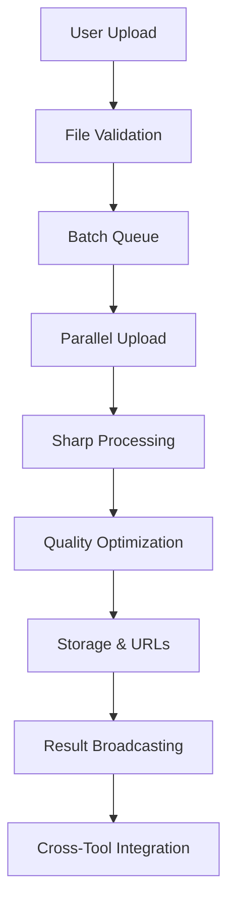

# Image Resizer - System Integration Architecture

**Last Updated**: December 29, 2024  
**Architecture Version**: 1.0  
**Integration Scope**: Cross-Tool Communication & System Services

## Integration Overview

Image Resizer operates as a sophisticated batch processing hub within the Toolspace ecosystem, seamlessly integrating with platform services, billing systems, and cross-tool workflows. The architecture emphasizes efficient data flow, professional-grade processing capabilities, and intelligent integration with complementary tools for comprehensive media workflow automation.

### Core Integration Principles

- **Batch Processing Excellence**: Optimized for high-volume image processing workflows
- **Professional Quality**: Sharp library integration for enterprise-grade image manipulation
- **Seamless Data Flow**: Efficient integration with storage, billing, and cross-tool communication
- **Intelligent Workflows**: Automated integration patterns for complex media processing pipelines

## Platform Service Integration

### Firebase Backend Integration

#### Cloud Functions Integration

**Processing Endpoint**: `functions/src/tools/image_resizer/resize_images.ts`

```typescript
// Batch processing interface
interface BatchResizeRequest {
  files: ImageFile[];
  settings: ResizeSettings;
  outputFormat: "jpeg" | "png" | "webp";
  quality: number;
  preserveAspectRatio: boolean;
  customDimensions?: { width: number; height: number };
  preset?: ResizePreset;
}

interface ResizeSettings {
  width?: number;
  height?: number;
  fit: "cover" | "contain" | "fill" | "inside" | "outside";
  position: "center" | "top" | "bottom" | "left" | "right";
  background?: string;
  withoutEnlargement?: boolean;
}
```

**Sharp Library Integration**:

```typescript
import sharp from "sharp";

export const processBatchResize = async (
  batch: BatchResizeRequest
): Promise<BatchResizeResult> => {
  const results: ProcessedImage[] = [];

  for (const file of batch.files) {
    try {
      const processedBuffer = await sharp(file.buffer)
        .resize(batch.settings.width, batch.settings.height, {
          fit: batch.settings.fit,
          position: batch.settings.position,
          background: batch.settings.background || {
            r: 255,
            g: 255,
            b: 255,
            alpha: 1,
          },
          withoutEnlargement: batch.settings.withoutEnlargement,
        })
        .toFormat(batch.outputFormat, {
          quality: batch.quality,
          progressive: true,
        })
        .toBuffer();

      results.push({
        originalFile: file,
        processedBuffer,
        metadata: await getImageMetadata(processedBuffer),
        processingTime: Date.now() - startTime,
      });
    } catch (error) {
      results.push({
        originalFile: file,
        error: error.message,
        processingTime: Date.now() - startTime,
      });
    }
  }

  return {
    results,
    totalProcessed: results.filter((r) => !r.error).length,
    totalErrors: results.filter((r) => r.error).length,
    batchProcessingTime: Date.now() - batchStartTime,
  };
};
```

#### Cloud Storage Integration

**Temporary Storage Strategy**:

```typescript
// Storage bucket configuration for batch processing
const TEMP_STORAGE_CONFIG = {
  bucket: "toolspace-temp-images",
  maxRetentionHours: 168, // 7 days
  maxBatchSize: 10,
  maxFileSize: 20 * 1024 * 1024, // 20MB per file
  autoCleanup: true,
};

interface StorageOperation {
  uploadBatch: (files: File[]) => Promise<UploadResult[]>;
  processAndStore: (settings: ProcessingSettings) => Promise<ProcessingResult>;
  generateDownloadUrls: (processedFiles: string[]) => Promise<DownloadUrl[]>;
  cleanupExpiredBatches: () => Promise<CleanupResult>;
}
```

**Batch Upload Management**:

- Parallel upload processing with error recovery
- Temporary file lifecycle management with automatic cleanup
- Download URL generation with expiration controls
- Storage quota integration with Pro plan limits

### Authentication & Authorization

#### Pro Plan Integration

**PaywallGuard Implementation**: `lib/billing/paywall_guard.dart`

```dart
class ImageResizerPaywallGuard extends PaywallGuard {
  @override
  String get featureName => 'image_resizer';

  @override
  List<SubscriptionPlan> get requiredPlans => [
    SubscriptionPlan.pro,
    SubscriptionPlan.team,
    SubscriptionPlan.enterprise
  ];

  @override
  Map<String, dynamic> get featureLimits => {
    'maxBatchSize': 10,
    'maxFileSize': 20 * 1024 * 1024,
    'maxMonthlyProcessing': 1000,
    'advancedFormats': ['webp', 'avif'],
    'customPresets': true,
    'batchNaming': true,
    'priorityProcessing': true
  };

  @override
  Future<bool> checkFeatureAccess({
    required String userId,
    Map<String, dynamic>? context
  }) async {
    final usage = await getMonthlyUsage(userId);
    final plan = await getUserSubscription(userId);

    return plan.tier.index >= SubscriptionPlan.pro.tier.index &&
           usage.imageProcessingCount < featureLimits['maxMonthlyProcessing'];
  }
}
```

#### Permission System

**Batch Processing Permissions**:

- Pro plan verification for batch processing access
- Monthly quota enforcement with usage tracking
- Advanced feature gates (formats, quality settings, batch size)
- Rate limiting for API protection and fair usage

### Billing System Integration

#### Stripe Integration

**Usage Tracking Implementation**: `functions/src/billing/usage_tracker.ts`

```typescript
interface ImageProcessingUsage {
  userId: string;
  timestamp: number;
  batchSize: number;
  totalFileSize: number;
  processingTimeMs: number;
  outputFormat: string;
  qualityLevel: number;
  success: boolean;
}

export const trackImageProcessing = async (usage: ImageProcessingUsage) => {
  // Track for billing and analytics
  await Promise.all([
    updateMonthlyUsageQuota(usage.userId, usage.batchSize),
    recordProcessingMetrics(usage),
    updateStripeUsageRecord(usage),
    logForAnalytics(usage),
  ]);
};
```

**Quota Management**:

- Real-time usage tracking against Pro plan limits
- Soft limits with upgrade prompts for enhanced experience
- Hard limits with clear upgrade pathways
- Usage analytics for optimization recommendations

## Cross-Tool Communication

### ShareBus Integration

#### Data Type Definitions

**Message Interface**: `lib/core/share_bus.dart`

```dart
// Image processing data types
class ImageBatch extends ShareableData {
  final List<ProcessedImage> images;
  final ResizeSettings settings;
  final DateTime processedAt;
  final String batchId;

  ImageBatch({
    required this.images,
    required this.settings,
    required this.processedAt,
    required this.batchId,
  });

  @override
  Map<String, dynamic> toJson() => {
    'type': 'image_batch',
    'images': images.map((img) => img.toJson()).toList(),
    'settings': settings.toJson(),
    'processedAt': processedAt.toIso8601String(),
    'batchId': batchId,
    'metadata': {
      'totalImages': images.length,
      'totalSize': images.fold(0, (sum, img) => sum + img.fileSize),
      'formats': images.map((img) => img.format).toSet().toList(),
    }
  };
}

class ProcessedImage extends ShareableData {
  final String filename;
  final String downloadUrl;
  final String format;
  final int fileSize;
  final ImageDimensions dimensions;
  final ImageDimensions originalDimensions;
  final double compressionRatio;

  ProcessedImage({
    required this.filename,
    required this.downloadUrl,
    required this.format,
    required this.fileSize,
    required this.dimensions,
    required this.originalDimensions,
    required this.compressionRatio,
  });
}
```

#### Message Broadcasting

**Batch Completion Broadcasting**:

```dart
// Broadcast processed image batch to other tools
void broadcastProcessedBatch(ImageBatch batch) {
  ShareBus.instance.broadcast(
    ShareMessage(
      type: ShareMessageType.imageProcessingComplete,
      data: batch,
      source: 'image_resizer',
      timestamp: DateTime.now(),
      metadata: {
        'batchSize': batch.images.length,
        'processingQuality': batch.settings.quality,
        'outputFormat': batch.settings.outputFormat,
        'availableUntil': DateTime.now().add(Duration(days: 7)),
      }
    )
  );
}
```

### File Merger Integration

#### Seamless Workflow Connection

**File Merger Communication**: `lib/tools/file_merger/image_resizer_integration.dart`

```dart
class ImageResizerToFileMergerBridge {
  // Receive processed images for PDF/document integration
  void handleImageBatch(ImageBatch batch) {
    final documentAssets = batch.images.map((image) =>
      DocumentAsset(
        filename: image.filename,
        downloadUrl: image.downloadUrl,
        assetType: AssetType.image,
        dimensions: image.dimensions,
        sourceMetadata: {
          'processedBy': 'image_resizer',
          'originalDimensions': image.originalDimensions,
          'compressionRatio': image.compressionRatio,
          'quality': batch.settings.quality,
        }
      )
    ).toList();

    FileMergerTool.instance.importAssets(documentAssets);
  }

  // Auto-resize images for optimal PDF inclusion
  Future<ImageBatch> prepareImagesForDocument({
    required List<String> imageUrls,
    required DocumentType targetFormat,
  }) async {
    final settings = _getOptimalSettingsForDocument(targetFormat);
    return await ImageResizerTool.instance.processBatch(imageUrls, settings);
  }
}
```

#### Automated Optimization Workflows

**PDF Integration Optimization**:

- Automatic image resizing for optimal PDF file sizes
- Quality adjustment based on document type (presentation vs. archival)
- Batch processing for multi-image document creation
- Format conversion for maximum PDF compatibility

### Text Tools Integration

#### OCR Preprocessing

**Image Optimization for OCR**: `lib/tools/text_tools/image_preprocessor.dart`

```dart
class OCRImagePreprocessor {
  // Optimize images for better OCR accuracy
  static Future<ProcessedImage> optimizeForOCR(String imageUrl) async {
    final ocrSettings = ResizeSettings(
      width: 2000, // Optimal resolution for OCR
      height: null, // Maintain aspect ratio
      quality: 95, // High quality for text clarity
      outputFormat: 'png', // Lossless for text preservation
      enhanceContrast: true,
      sharpen: 0.5,
      despeckle: true,
    );

    return await ImageResizerTool.instance.processImage(imageUrl, ocrSettings);
  }

  // Batch process images for OCR workflows
  static Future<ImageBatch> prepareBatchForOCR(List<String> imageUrls) async {
    return await ImageResizerTool.instance.processBatch(
      imageUrls,
      _getOCROptimizedSettings()
    );
  }
}
```

### QR Maker Integration

#### QR Code Asset Management

**Dynamic QR Integration**: `lib/tools/qr_maker/image_integration.dart`

```dart
class QRImageIntegration {
  // Resize QR codes for different use cases
  static Future<QRImageVariants> createQRVariants(String qrImageUrl) async {
    final variants = await Future.wait([
      // Web thumbnail
      ImageResizerTool.instance.processImage(qrImageUrl, ResizeSettings(
        width: 150, height: 150, quality: 85, format: 'webp'
      )),
      // Print quality
      ImageResizerTool.instance.processImage(qrImageUrl, ResizeSettings(
        width: 1200, height: 1200, quality: 100, format: 'png'
      )),
      // Mobile display
      ImageResizerTool.instance.processImage(qrImageUrl, ResizeSettings(
        width: 512, height: 512, quality: 90, format: 'png'
      )),
    ]);

    return QRImageVariants(
      thumbnail: variants[0],
      printQuality: variants[1],
      mobileDisplay: variants[2],
    );
  }
}
```

## Data Flow Architecture

### Batch Processing Pipeline

#### Input Processing Flow



#### Processing Optimization

**Parallel Processing Strategy**:

```typescript
interface ProcessingQueue {
  batchId: string;
  files: QueuedFile[];
  settings: ProcessingSettings;
  priority: ProcessingPriority;
  userId: string;
  createdAt: Date;
}

const processImageBatch = async (queue: ProcessingQueue) => {
  // Process up to 3 images simultaneously for optimal performance
  const chunks = chunkArray(queue.files, 3);
  const results: ProcessingResult[] = [];

  for (const chunk of chunks) {
    const chunkResults = await Promise.all(
      chunk.map((file) => processImageWithSharp(file, queue.settings))
    );
    results.push(...chunkResults);

    // Update progress for real-time feedback
    await updateProcessingProgress(
      queue.batchId,
      results.length,
      queue.files.length
    );
  }

  return results;
};
```

### Error Handling & Recovery

#### Comprehensive Error Management

**Error Recovery Strategy**:

```typescript
interface ProcessingError {
  fileId: string;
  errorType: "validation" | "processing" | "storage" | "network";
  message: string;
  retryable: boolean;
  suggestedAction: string;
}

const handleProcessingError = async (error: ProcessingError) => {
  switch (error.errorType) {
    case "validation":
      // Provide format conversion suggestions
      return await suggestFormatConversion(error.fileId);

    case "processing":
      // Retry with alternative settings
      if (error.retryable) {
        return await retryWithFallbackSettings(error.fileId);
      }
      break;

    case "storage":
      // Retry storage operation with exponential backoff
      return await retryStorageOperation(error.fileId);

    case "network":
      // Queue for retry when connection restored
      return await queueForRetry(error.fileId);
  }
};
```

#### Graceful Degradation

- Partial batch processing with successful file completion
- Alternative format suggestions for failed conversions
- Quality adjustment recommendations for performance optimization
- Offline queue management for network interruption recovery

## Security Integration

### Data Protection

#### Secure File Handling

**Temporary File Security**: `functions/src/security/temp_file_manager.ts`

```typescript
interface SecureFileHandle {
  tempPath: string;
  encryptionKey: string;
  expirationTime: Date;
  accessTokens: string[];
}

export const secureFileProcessor = {
  // Encrypt uploaded files during processing
  createSecureHandle: async (file: UploadedFile): Promise<SecureFileHandle> => {
    const encryptionKey = await generateEncryptionKey();
    const tempPath = await storeEncryptedFile(file, encryptionKey);

    return {
      tempPath,
      encryptionKey,
      expirationTime: new Date(Date.now() + 7 * 24 * 60 * 60 * 1000), // 7 days
      accessTokens: await generateAccessTokens(file.userId),
    };
  },

  // Process with encryption throughout pipeline
  processSecurely: async (
    handle: SecureFileHandle,
    settings: ProcessingSettings
  ) => {
    const decryptedBuffer = await decryptFile(
      handle.tempPath,
      handle.encryptionKey
    );
    const processedBuffer = await processWithSharp(decryptedBuffer, settings);
    return await encryptProcessedFile(processedBuffer, handle.encryptionKey);
  },
};
```

#### Privacy Compliance

- End-to-end encryption for uploaded images during processing
- Automatic cleanup of temporary files with secure deletion
- Access token management for download URL security
- GDPR compliance with data retention controls

### Input Validation

#### Comprehensive Security Validation

**File Security Checks**: `lib/tools/image_resizer/security/file_validator.dart`

```dart
class ImageSecurityValidator {
  // Multi-layer security validation
  static Future<ValidationResult> validateImageFile(File file) async {
    final checks = await Future.wait([
      _validateFileSignature(file),
      _scanForMaliciousContent(file),
      _validateImageIntegrity(file),
      _checkFileSize(file),
      _validateMetadata(file),
    ]);

    final failedChecks = checks.where((check) => !check.passed).toList();

    return ValidationResult(
      passed: failedChecks.isEmpty,
      failures: failedChecks,
      securityLevel: _calculateSecurityLevel(checks),
    );
  }

  static Future<SecurityCheck> _validateFileSignature(File file) async {
    final signature = await getFileSignature(file);
    final allowedSignatures = {
      'image/jpeg': [0xFF, 0xD8, 0xFF],
      'image/png': [0x89, 0x50, 0x4E, 0x47],
      'image/webp': [0x52, 0x49, 0x46, 0x46],
      'image/gif': [0x47, 0x49, 0x46],
    };

    return SecurityCheck(
      name: 'file_signature',
      passed: allowedSignatures.values.any((sig) =>
        signature.take(sig.length).toList().toString() == sig.toString()
      ),
      details: 'File signature validation against known image formats'
    );
  }
}
```

## Performance Optimization

### Caching Strategy

#### Multi-Level Caching

**Processing Cache Implementation**:

```typescript
interface ProcessingCache {
  // Cache processed images for common settings
  getCachedResult: (
    fileHash: string,
    settings: ProcessingSettings
  ) => Promise<CachedResult | null>;
  cacheResult: (
    fileHash: string,
    settings: ProcessingSettings,
    result: ProcessingResult
  ) => Promise<void>;
  invalidateCache: (pattern: string) => Promise<void>;

  // Intelligent cache management
  optimizeCache: () => Promise<CacheOptimizationResult>;
  getCacheStats: () => Promise<CacheStatistics>;
}

const processingCache = new RedisCache({
  keyPrefix: "image_resizer:",
  defaultTTL: 24 * 60 * 60, // 24 hours
  maxMemory: "2gb",
  evictionPolicy: "allkeys-lru",
});
```

#### Smart Caching Logic

- Hash-based caching for identical file and settings combinations
- Progressive cache warming for common processing presets
- Intelligent cache invalidation based on usage patterns
- Memory optimization with LRU eviction for large batch processing

### Resource Management

#### Optimized Processing Resources

**Resource Allocation Strategy**:

```typescript
interface ResourceManager {
  // Dynamic resource allocation based on batch size
  allocateProcessingResources: (batchSize: number) => ProcessingResources;
  monitorMemoryUsage: () => MemoryMetrics;
  optimizeForBatchSize: (size: number) => OptimizationSettings;
  handleResourceExhaustion: () => Promise<ResourceRecovery>;
}

const resourceOptimization = {
  // Adjust processing parameters based on available resources
  getOptimalSettings: (batchSize: number, availableMemory: number) => {
    if (batchSize > 5 && availableMemory < 1024 * 1024 * 1024) {
      // < 1GB
      return {
        parallelProcessing: 2,
        qualityReduction: 0.1,
        temporaryCompression: true,
        progressiveProcessing: true,
      };
    }

    return {
      parallelProcessing: 3,
      qualityReduction: 0,
      temporaryCompression: false,
      progressiveProcessing: false,
    };
  },
};
```

---

**Integration Review Schedule**: Bi-weekly architecture assessment with performance monitoring  
**Cross-Tool Testing**: Monthly integration validation across all connected tools  
**Security Audit**: Quarterly comprehensive security review with penetration testing  
**Performance Optimization**: Continuous monitoring with monthly optimization reviews
