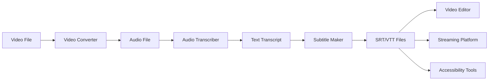

# Subtitle Maker Tool - Integration Guide

> **Tool ID**: `subtitle-maker`  
> **Integration Type**: Media Processing Pipeline  
> **ShareEnvelope Compatible**: Yes  
> **API Level**: Advanced

## Integration Overview

The Subtitle Maker tool serves as the **final stage** in the media processing pipeline, converting text transcripts into properly formatted subtitle files. It integrates seamlessly with the Audio Transcriber tool and provides multiple output formats for diverse video platforms.

## ShareEnvelope Framework Integration

### Data Reception

#### From Audio Transcriber

```dart
// Automatic data reception from Audio Transcriber
ShareEnvelope.receive<String>(
  toolId: 'audio-transcriber',
  dataType: 'transcript',
  onReceive: (transcript) {
    _transcriptController.text = transcript;
    _generateSubtitles();
  },
);
```

#### From Text Tools

```dart
// Receive processed text from Text Tools
ShareEnvelope.receive<String>(
  toolId: 'text-tools',
  dataType: 'processed_text',
  onReceive: (processedText) {
    _transcriptController.text = processedText;
    _showDataReceivedNotification('Text Tools');
  },
);
```

### Data Sharing

#### To File Manager

```dart
// Share generated subtitles with File Manager
ShareEnvelope.send<Map<String, String>>(
  toolId: 'file-manager',
  dataType: 'subtitle_files',
  data: {
    'srt_content': srtContent,
    'vtt_content': vttContent,
    'filename': 'subtitles_${DateTime.now().millisecondsSinceEpoch}',
  },
  metadata: {
    'source_tool': 'subtitle-maker',
    'format_count': 2,
    'transcript_length': _transcriptController.text.length,
  },
);
```

#### To Cloud Storage

```dart
// Export subtitles to cloud storage services
ShareEnvelope.send<SubtitleExportData>(
  toolId: 'cloud-storage',
  dataType: 'subtitle_export',
  data: SubtitleExportData(
    srtContent: srtContent,
    vttContent: vttContent,
    projectName: projectName,
    metadata: {
      'created_at': DateTime.now().toIso8601String(),
      'source_transcript_hash': transcriptHash,
      'subtitle_count': subtitleCount,
    },
  ),
);
```

## Cross-Tool Workflow Integration

### Complete Media Processing Pipeline



### Workflow Implementation

#### Pipeline Initialization

```dart
class MediaProcessingPipeline {
  static Future<void> initializeSubtitleGeneration({
    required String videoPath,
    String? projectName,
  }) async {
    // Step 1: Convert video to audio
    final audioPath = await VideoConverter.convert(videoPath);

    // Step 2: Transcribe audio to text
    final transcript = await AudioTranscriber.transcribe(audioPath);

    // Step 3: Generate subtitles (this tool)
    final subtitles = await SubtitleMaker.generate(transcript);

    // Step 4: Export for use
    await _exportSubtitles(subtitles, projectName);
  }
}
```

#### Cross-Tool Data Flow

```dart
class SubtitleMakerIntegration {
  // Receive data from previous tools in pipeline
  static void setupPipelineIntegration() {
    // Listen for transcript data
    ShareEnvelope.subscribe('transcript_ready', (data) {
      final transcript = data['text'] as String;
      final source = data['source'] as String;

      SubtitleMakerScreen.autoPopulate(
        transcript: transcript,
        sourceToolName: source,
      );
    });
  }

  // Send data to next tools in pipeline
  static void publishSubtitles(SubtitleResult result) {
    ShareEnvelope.publish('subtitles_ready', {
      'srt_content': result.srtContent,
      'vtt_content': result.vttContent,
      'subtitle_count': result.subtitleCount,
      'total_duration': result.totalDuration.inSeconds,
    });
  }
}
```

## API Integration

### REST API Endpoints

#### Generate Subtitles

```http
POST /api/v1/tools/subtitle-maker/generate
Content-Type: application/json

{
  "transcript": "Hello world. This is a sample transcript.",
  "format": "both", // "srt", "vtt", or "both"
  "timing_mode": "auto", // "auto" or "manual"
  "subtitle_duration": 3 // seconds per subtitle
}
```

**Response:**

```json
{
  "success": true,
  "data": {
    "srt_content": "1\n00:00:00,000 --> 00:00:03,000\nHello world.\n\n2\n00:00:03,000 --> 00:00:06,000\nThis is a sample transcript.\n\n",
    "vtt_content": "WEBVTT\n\n00:00:00.000 --> 00:00:03.000\nHello world.\n\n00:00:03.000 --> 00:00:06.000\nThis is a sample transcript.\n\n",
    "subtitle_count": 2,
    "total_duration": 6
  },
  "metadata": {
    "generated_at": "2025-10-11T10:30:00Z",
    "processing_time_ms": 145,
    "transcript_length": 42
  }
}
```

#### Validate Transcript

```http
POST /api/v1/tools/subtitle-maker/validate
Content-Type: application/json

{
  "transcript": "Sample text to validate..."
}
```

**Response:**

```json
{
  "valid": true,
  "warnings": ["Text is quite long (2000+ characters)"],
  "suggestions": ["Consider breaking long sentences for better readability"],
  "estimated_subtitle_count": 67
}
```

### WebSocket Integration

#### Real-time Subtitle Generation

```dart
class SubtitleMakerWebSocket {
  static WebSocketChannel? _channel;

  static void connect() {
    _channel = WebSocketChannel.connect(
      Uri.parse('wss://api.toolspace.dev/ws/subtitle-maker'),
    );

    _channel!.stream.listen((message) {
      final data = jsonDecode(message);
      _handleWebSocketMessage(data);
    });
  }

  static void generateSubtitlesRealtime(String transcript) {
    _channel!.sink.add(jsonEncode({
      'action': 'generate_subtitles',
      'transcript': transcript,
      'session_id': _sessionId,
    }));
  }

  static void _handleWebSocketMessage(Map<String, dynamic> data) {
    switch (data['type']) {
      case 'subtitle_progress':
        _updateProgress(data['progress']);
        break;
      case 'subtitle_complete':
        _displayResults(data['subtitles']);
        break;
      case 'error':
        _handleError(data['message']);
        break;
    }
  }
}
```

## Enterprise Integration Patterns

### Batch Processing Integration

```dart
class SubtitleMakerBatchProcessor {
  static Future<List<SubtitleResult>> processBatch(
    List<String> transcripts, {
    String format = 'both',
    Map<String, dynamic>? globalSettings,
  }) async {
    final results = <SubtitleResult>[];

    for (int i = 0; i < transcripts.length; i++) {
      final transcript = transcripts[i];

      try {
        final result = await SubtitleMakerService().generateSubtitles(
          transcript,
          settings: globalSettings,
        );
        results.add(result);

        // Progress callback
        onProgress?.call(i + 1, transcripts.length);

      } catch (error) {
        // Handle individual failures
        results.add(SubtitleResult.error(error.toString()));
      }
    }

    return results;
  }
}
```

### Workflow Automation

```dart
class SubtitleMakerAutomation {
  static Future<void> setupAutomatedPipeline() async {
    // Watch for new transcripts in designated folder
    final watcher = DirectoryWatcher('/path/to/transcripts');

    watcher.events.listen((event) async {
      if (event.type == ChangeType.ADD &&
          event.path.endsWith('.txt')) {

        // Read transcript file
        final transcript = await File(event.path).readAsString();

        // Generate subtitles automatically
        final result = await SubtitleMakerService().generateSubtitles(transcript);

        // Save to output directory
        await _saveSubtitleFiles(result, event.path);

        // Notify completion
        await _notifyCompletion(event.path, result);
      }
    });
  }
}
```

## Third-Party Service Integration

### Video Platform APIs

#### YouTube Integration

```dart
class YouTubeSubtitleIntegration {
  static Future<void> uploadSubtitles({
    required String videoId,
    required String srtContent,
    required String language,
  }) async {
    final youtube = YouTubeApi(_authClient);

    final caption = Caption()
      ..snippet = (CaptionSnippet()
        ..videoId = videoId
        ..language = language
        ..name = 'Generated Subtitles');

    await youtube.captions.insert(
      caption,
      'snippet',
      uploadMedia: Media(
        Stream.fromIterable([utf8.encode(srtContent)]),
        srtContent.length,
      ),
    );
  }
}
```

#### Vimeo Integration

```dart
class VimeoSubtitleIntegration {
  static Future<void> uploadSubtitles({
    required String videoId,
    required String vttContent,
    required String language,
  }) async {
    final response = await http.post(
      Uri.parse('https://api.vimeo.com/videos/$videoId/texttracks'),
      headers: {
        'Authorization': 'Bearer $vimeoAccessToken',
        'Content-Type': 'application/json',
      },
      body: jsonEncode({
        'type': 'subtitles',
        'language': language,
        'name': 'Generated Subtitles',
      }),
    );

    if (response.statusCode == 201) {
      final trackData = jsonDecode(response.body);
      final uploadLink = trackData['link'];

      // Upload VTT content to the provided link
      await http.put(
        Uri.parse(uploadLink),
        headers: {'Content-Type': 'text/vtt'},
        body: vttContent,
      );
    }
  }
}
```

### Content Management Systems

#### WordPress Integration

```dart
class WordPressSubtitleIntegration {
  static Future<void> attachSubtitlesToPost({
    required int postId,
    required SubtitleResult subtitles,
  }) async {
    // Upload subtitle files as media attachments
    final srtAttachment = await _uploadMediaFile(
      filename: 'subtitles.srt',
      content: subtitles.srtContent,
      mimeType: 'text/srt',
    );

    final vttAttachment = await _uploadMediaFile(
      filename: 'subtitles.vtt',
      content: subtitles.vttContent,
      mimeType: 'text/vtt',
    );

    // Update post meta with subtitle file IDs
    await wp.posts.update(postId, {
      'meta': {
        'subtitle_srt_id': srtAttachment.id,
        'subtitle_vtt_id': vttAttachment.id,
      },
    });
  }
}
```

## Development Integration

### Testing Integration

```dart
class SubtitleMakerTestIntegration {
  static void setupTestEnvironment() {
    // Mock ShareEnvelope for testing
    ShareEnvelope.enableTestMode();

    // Register test data providers
    ShareEnvelope.registerTestData('audio-transcriber', {
      'transcript': 'This is a test transcript for subtitle generation.',
    });
  }

  static Future<void> runIntegrationTests() async {
    group('Subtitle Maker Integration Tests', () {
      test('should receive data from Audio Transcriber', () async {
        // Simulate data from Audio Transcriber
        ShareEnvelope.simulateReceive(
          fromTool: 'audio-transcriber',
          dataType: 'transcript',
          data: 'Test transcript content.',
        );

        // Verify subtitle maker receives and processes data
        expect(SubtitleMakerScreen.hasReceivedData, isTrue);
        expect(SubtitleMakerScreen.currentTranscript, equals('Test transcript content.'));
      });
    });
  }
}
```

### CI/CD Integration

```yaml
# .github/workflows/subtitle-maker-integration.yml
name: Subtitle Maker Integration Tests

on:
  push:
    paths:
      - "lib/tools/subtitle_maker/**"
      - "test/tools/subtitle_maker/**"

jobs:
  test-integration:
    runs-on: ubuntu-latest
    steps:
      - uses: actions/checkout@v3

      - name: Setup Flutter
        uses: subosito/flutter-action@v2

      - name: Run Integration Tests
        run: |
          flutter test test/tools/subtitle_maker/integration_test.dart

      - name: Test Cross-Tool Integration
        run: |
          flutter test test/integration/subtitle_maker_pipeline_test.dart

      - name: Validate API Compatibility
        run: |
          dart run test/api/subtitle_maker_api_test.dart
```

## Monitoring and Analytics

### Performance Monitoring

```dart
class SubtitleMakerMonitoring {
  static void trackSubtitleGeneration({
    required String transcript,
    required SubtitleResult result,
    required Duration processingTime,
  }) {
    Analytics.track('subtitle_generation_completed', {
      'transcript_length': transcript.length,
      'subtitle_count': result.subtitleCount,
      'processing_time_ms': processingTime.inMilliseconds,
      'formats_generated': ['srt', 'vtt'],
    });
  }

  static void trackIntegrationUsage({
    required String sourceToolId,
    required String targetToolId,
  }) {
    Analytics.track('cross_tool_integration', {
      'source_tool': sourceToolId,
      'target_tool': targetToolId,
      'integration_type': 'shareenvelope',
    });
  }
}
```

### Error Tracking

```dart
class SubtitleMakerErrorTracking {
  static void reportIntegrationError({
    required String errorType,
    required String errorMessage,
    required Map<String, dynamic> context,
  }) {
    ErrorReporting.report(
      error: SubtitleMakerIntegrationError(errorType, errorMessage),
      context: {
        'tool_id': 'subtitle-maker',
        'integration_context': context,
        'timestamp': DateTime.now().toIso8601String(),
      },
    );
  }
}
```

## Best Practices

### Integration Guidelines

1. **Data Validation**: Always validate incoming data from other tools
2. **Error Handling**: Gracefully handle integration failures
3. **Performance**: Optimize for cross-tool data transfer efficiency
4. **Security**: Validate and sanitize all external data
5. **Compatibility**: Maintain backward compatibility with API changes

### ShareEnvelope Usage

```dart
// Good: Proper error handling
ShareEnvelope.receive<String>(
  toolId: 'audio-transcriber',
  dataType: 'transcript',
  onReceive: (transcript) {
    try {
      if (transcript.isNotEmpty) {
        _processTranscript(transcript);
      } else {
        _showError('Empty transcript received');
      }
    } catch (e) {
      _handleProcessingError(e);
    }
  },
  onError: (error) {
    _showError('Failed to receive transcript: $error');
  },
);

// Bad: No error handling
ShareEnvelope.receive<String>(
  toolId: 'audio-transcriber',
  dataType: 'transcript',
  onReceive: (transcript) {
    _transcriptController.text = transcript; // Could fail
  },
);
```

### API Integration

```dart
// Good: Comprehensive error handling
Future<SubtitleResult> generateSubtitlesAPI(String transcript) async {
  try {
    final response = await http.post(
      Uri.parse('/api/v1/tools/subtitle-maker/generate'),
      headers: {'Content-Type': 'application/json'},
      body: jsonEncode({'transcript': transcript}),
    );

    if (response.statusCode == 200) {
      return SubtitleResult.fromJson(jsonDecode(response.body));
    } else {
      throw SubtitleGenerationException(
        'API Error: ${response.statusCode}',
        response.body,
      );
    }
  } catch (e) {
    throw SubtitleGenerationException('Network error', e.toString());
  }
}
```

## Migration Guide

### Upgrading from v1.0 to v2.0

```dart
// Old v1.0 API
final result = SubtitleMaker.generate(transcript);

// New v2.0 API with enhanced options
final result = await SubtitleMakerService().generateSubtitles(
  transcript,
  options: SubtitleGenerationOptions(
    format: SubtitleFormat.both,
    timingMode: TimingMode.automatic,
    subtitleDuration: Duration(seconds: 3),
  ),
);
```

### Breaking Changes

- `generateSubtitles()` now returns `Future<SubtitleResult>`
- Added required `options` parameter for advanced configuration
- `SubtitleResult` now includes metadata and timing information

---

**Integration Guide Version**: 2.0.0  
**Last Updated**: October 11, 2025  
**API Compatibility**: v1.0+ with deprecation warnings  
**Next Review**: January 11, 2026
