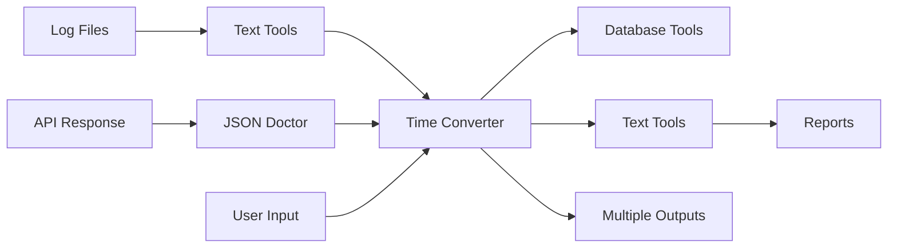

# Time Converter Tool - Integration Guide

> **Tool ID**: `time-convert`  
> **Integration Type**: Timestamp Processing Pipeline  
> **ShareEnvelope Compatible**: Yes  
> **API Level**: Standard

## Integration Overview

The Time Converter tool serves as a **universal timestamp processing hub** in the ToolSpace ecosystem, providing seamless conversion between all major timestamp formats. It integrates with data processing tools, APIs, logs analyzers, and text processing utilities to standardize temporal data across workflows.

## ShareEnvelope Framework Integration

### Data Reception

#### From JSON Doctor

```dart
// Receive timestamp fields for conversion
ShareEnvelope.receive<String>(
  toolId: 'json-doctor',
  dataType: 'timestamp_field',
  onReceive: (timestamp) {
    _inputController.text = timestamp;
    _onInputChanged();
  },
);
```

#### From Text Tools

```dart
// Receive extracted timestamps from text
ShareEnvelope.receive<List<String>>(
  toolId: 'text-tools',
  dataType: 'extracted_timestamps',
  onReceive: (timestamps) {
    if (timestamps.isNotEmpty) {
      _inputController.text = timestamps.first;
      _showBatchProcessingOption(timestamps);
    }
  },
);
```

#### From API Tools

```dart
// Receive API response timestamps
ShareEnvelope.receive<Map<String, dynamic>>(
  toolId: 'api-tools',
  dataType: 'api_response',
  onReceive: (response) {
    final timestamp = _extractTimestamp(response);
    if (timestamp != null) {
      _inputController.text = timestamp;
      _autoDetectFormat();
    }
  },
);
```

### Data Sharing

#### To Text Tools

```dart
// Share formatted timestamps for text processing
ShareEnvelope.send<Map<String, String>>(
  toolId: 'text-tools',
  dataType: 'formatted_timestamps',
  data: {
    'iso8601': _formatISO8601(),
    'unix_seconds': _formatUnixSeconds(),
    'human_readable': _formatHumanReadable(),
    'original_input': _inputController.text,
  },
  metadata: {
    'source_tool': 'time-convert',
    'conversion_timestamp': DateTime.now().toIso8601String(),
    'timezone': _selectedTimezone,
  },
);
```

#### To API Tools

```dart
// Share timestamps for API requests
ShareEnvelope.send<TimestampData>(
  toolId: 'api-tools',
  dataType: 'request_timestamp',
  data: TimestampData(
    unixSeconds: _toUnixSeconds(),
    unixMilliseconds: _toUnixMilliseconds(),
    iso8601: _toISO8601(),
    timezone: _selectedTimezone,
  ),
);
```

#### To Database Tools

```dart
// Share formatted timestamps for database operations
ShareEnvelope.send<DatabaseTimestamp>(
  toolId: 'database-tools',
  dataType: 'formatted_timestamp',
  data: DatabaseTimestamp(
    mysqlFormat: _toMySQLFormat(),
    postgresFormat: _toPostgresFormat(),
    mongoFormat: _toMongoFormat(),
    originalInput: _inputController.text,
  ),
);
```

## Cross-Tool Workflow Integration

### Complete Timestamp Processing Pipeline



### Workflow Implementation

#### Log Processing Pipeline

```dart
class TimestampProcessingPipeline {
  static Future<void> processLogTimestamps({
    required String logContent,
    required String targetFormat,
  }) async {
    // Step 1: Extract timestamps from logs
    final extractedTimestamps = await TextTools.extractTimestamps(logContent);

    // Step 2: Convert to standardized format
    final convertedTimestamps = <String>[];
    for (final timestamp in extractedTimestamps) {
      final converted = await TimeConverter.convert(timestamp, targetFormat);
      convertedTimestamps.add(converted);
    }

    // Step 3: Replace in original content
    final processedContent = await TextTools.replaceTimestamps(
      logContent,
      convertedTimestamps,
    );

    // Step 4: Export for analysis
    await _exportProcessedLogs(processedContent);
  }
}
```

#### API Integration Pipeline

```dart
class APITimestampIntegration {
  static void setupIntegration() {
    // Listen for API response timestamps
    ShareEnvelope.subscribe('api_response_received', (data) {
      final timestamps = _extractTimestampsFromAPI(data);

      for (final timestamp in timestamps) {
        TimeConverter.convertAndShare(
          timestamp: timestamp,
          targetTools: ['database-tools', 'reporting-tools'],
        );
      }
    });
  }
}
```

## API Integration

### REST API Endpoints

#### Convert Timestamp

```http
POST /api/v1/tools/time-convert/convert
Content-Type: application/json

{
  "input": "5 minutes ago",
  "timezone": "UTC",
  "output_formats": ["iso8601", "unix_seconds", "human_readable"]
}
```

**Response:**

```json
{
  "success": true,
  "data": {
    "input": "5 minutes ago",
    "parsed_datetime": "2024-01-15T10:25:00.000Z",
    "timezone": "UTC",
    "formats": {
      "iso8601": "2024-01-15T10:25:00.000Z",
      "unix_seconds": 1705318500,
      "unix_milliseconds": 1705318500000,
      "human_readable": "2024-01-15 10:25:00",
      "relative_time": "5 minutes ago"
    }
  },
  "metadata": {
    "processing_time_ms": 45,
    "conversion_timestamp": "2024-01-15T10:30:00.000Z"
  }
}
```

#### Batch Convert

```http
POST /api/v1/tools/time-convert/batch
Content-Type: application/json

{
  "timestamps": [
    "now",
    "1234567890",
    "2024-01-15T10:30:00Z"
  ],
  "timezone": "America/New_York",
  "output_format": "iso8601"
}
```

#### Validate Timestamp

```http
POST /api/v1/tools/time-convert/validate
Content-Type: application/json

{
  "input": "invalid timestamp",
  "timezone": "UTC"
}
```

**Response:**

```json
{
  "valid": false,
  "errors": ["Unable to parse 'invalid timestamp'"],
  "suggestions": [
    "Try natural language: 'now', 'yesterday', '5 minutes ago'",
    "Try Unix timestamp: '1234567890'",
    "Try ISO format: '2024-01-15T10:30:00Z'"
  ]
}
```

### WebSocket Integration

#### Real-Time Conversion Stream

```dart
class TimeConverterWebSocket {
  static WebSocketChannel? _channel;

  static void connect() {
    _channel = WebSocketChannel.connect(
      Uri.parse('wss://api.toolspace.dev/ws/time-convert'),
    );

    _channel!.stream.listen((message) {
      final data = jsonDecode(message);
      _handleRealtimeConversion(data);
    });
  }

  static void streamConversions(String input) {
    _channel!.sink.add(jsonEncode({
      'action': 'convert_realtime',
      'input': input,
      'session_id': _sessionId,
    }));
  }
}
```

## Enterprise Integration Patterns

### Database System Integration

#### MySQL Integration

```dart
class MySQLTimestampIntegration {
  static String convertForMySQL(DateTime dateTime) {
    // MySQL DATETIME format: YYYY-MM-DD HH:MM:SS
    return dateTime.toUtc().toIso8601String()
        .replaceAll('T', ' ')
        .replaceAll(RegExp(r'\.\d+Z$'), '');
  }

  static Future<void> bulkUpdateTimestamps({
    required String tableName,
    required String columnName,
    required List<String> timestamps,
  }) async {
    final convertedTimestamps = timestamps
        .map((ts) => TimeConverter.parseAndConvert(ts, 'mysql'))
        .toList();

    // Execute bulk update
    await _executeBulkUpdate(tableName, columnName, convertedTimestamps);
  }
}
```

#### PostgreSQL Integration

```dart
class PostgreSQLTimestampIntegration {
  static String convertForPostgreSQL(DateTime dateTime, {bool withTimezone = true}) {
    if (withTimezone) {
      // TIMESTAMPTZ format
      return dateTime.toUtc().toIso8601String();
    } else {
      // TIMESTAMP format
      return dateTime.toIso8601String().replaceAll('Z', '');
    }
  }
}
```

#### MongoDB Integration

```dart
class MongoDBTimestampIntegration {
  static Map<String, dynamic> convertForMongoDB(DateTime dateTime) {
    return {
      r'$date': {
        r'$numberLong': dateTime.millisecondsSinceEpoch.toString(),
      }
    };
  }
}
```

### Log Management Integration

#### ELK Stack Integration

```dart
class ELKStackIntegration {
  static Future<void> processLogstashTimestamps({
    required String logContent,
    required String timestampField,
  }) async {
    final logEntries = _parseLogEntries(logContent);

    for (final entry in logEntries) {
      final originalTimestamp = entry[timestampField];
      if (originalTimestamp != null) {
        final standardized = await TimeConverter.convertToISO8601(
          originalTimestamp,
        );
        entry[timestampField] = standardized;
      }
    }

    await _sendToElasticsearch(logEntries);
  }
}
```

#### Splunk Integration

```dart
class SplunkIntegration {
  static String convertForSplunk(DateTime dateTime) {
    // Splunk timestamp format: MM/dd/yyyy HH:mm:ss
    final month = dateTime.month.toString().padLeft(2, '0');
    final day = dateTime.day.toString().padLeft(2, '0');
    final year = dateTime.year.toString();
    final hour = dateTime.hour.toString().padLeft(2, '0');
    final minute = dateTime.minute.toString().padLeft(2, '0');
    final second = dateTime.second.toString().padLeft(2, '0');

    return '$month/$day/$year $hour:$minute:$second';
  }
}
```

## Third-Party Service Integration

### Cloud Provider APIs

#### AWS CloudWatch Integration

```dart
class CloudWatchIntegration {
  static Future<void> convertMetricTimestamps({
    required List<MetricDataPoint> dataPoints,
  }) async {
    for (final dataPoint in dataPoints) {
      // CloudWatch expects Unix timestamp in seconds
      dataPoint.timestamp = TimeConverter.toUnixSeconds(dataPoint.dateTime);
    }

    await _sendToCloudWatch(dataPoints);
  }
}
```

#### Google Cloud Logging Integration

```dart
class GoogleCloudLoggingIntegration {
  static LogEntry convertTimestamp(LogEntry entry) {
    // Google Cloud expects RFC 3339 timestamp
    entry.timestamp = TimeConverter.toRFC3339(entry.dateTime);
    return entry;
  }
}
```

### Monitoring System Integration

#### Prometheus Integration

```dart
class PrometheusIntegration {
  static double convertForPrometheus(DateTime dateTime) {
    // Prometheus uses Unix timestamp with decimal seconds
    return dateTime.millisecondsSinceEpoch / 1000.0;
  }
}
```

#### Grafana Integration

```dart
class GrafanaIntegration {
  static Map<String, dynamic> convertDataPoint({
    required DateTime timestamp,
    required double value,
  }) {
    return {
      'timestamp': TimeConverter.toUnixMilliseconds(timestamp),
      'value': value,
    };
  }
}
```

## Development Integration

### CI/CD Pipeline Integration

```yaml
# .github/workflows/timestamp-processing.yml
name: Timestamp Processing Pipeline

on:
  push:
    paths:
      - "logs/**"
      - "data/**"

jobs:
  process-timestamps:
    runs-on: ubuntu-latest
    steps:
      - uses: actions/checkout@v3

      - name: Setup Time Converter API
        run: |
          curl -X POST "${{ secrets.TIMECONVERT_API_URL }}/batch" \
            -H "Content-Type: application/json" \
            -d @timestamp-batch.json

      - name: Validate Conversions
        run: |
          dart run tools/validate_timestamps.dart
```

### Testing Integration

```dart
class TimeConverterTestIntegration {
  static void setupTestEnvironment() {
    // Mock ShareEnvelope for testing
    ShareEnvelope.enableTestMode();

    // Register test timestamp data
    ShareEnvelope.registerTestData('timestamp-samples', {
      'unix_seconds': '1234567890',
      'iso8601': '2024-01-15T10:30:00.000Z',
      'natural_language': '5 minutes ago',
    });
  }

  static Future<void> runIntegrationTests() async {
    group('Time Converter Integration Tests', () {
      test('should receive timestamps from JSON Doctor', () async {
        // Simulate JSON with timestamp field
        ShareEnvelope.simulateReceive(
          fromTool: 'json-doctor',
          dataType: 'timestamp_field',
          data: '1234567890',
        );

        // Verify conversion and sharing
        expect(TimeConverter.hasProcessedTimestamp, isTrue);
        expect(TimeConverter.lastConvertedFormat, equals('iso8601'));
      });
    });
  }
}
```

## Performance Optimization

### Caching Strategy

```dart
class TimestampConversionCache {
  static final Map<String, ConversionResult> _cache = {};
  static const int maxCacheSize = 1000;

  static ConversionResult? getCachedConversion(String input, String timezone) {
    final key = '$input|$timezone';
    return _cache[key];
  }

  static void cacheConversion(
    String input,
    String timezone,
    ConversionResult result,
  ) {
    if (_cache.length >= maxCacheSize) {
      _cache.remove(_cache.keys.first);
    }

    final key = '$input|$timezone';
    _cache[key] = result;
  }
}
```

### Batch Processing Optimization

```dart
class BatchTimestampProcessor {
  static Future<List<ConversionResult>> processBatch({
    required List<String> timestamps,
    required String targetFormat,
    String timezone = 'UTC',
  }) async {
    final results = <ConversionResult>[];
    const batchSize = 100;

    for (int i = 0; i < timestamps.length; i += batchSize) {
      final batch = timestamps.skip(i).take(batchSize).toList();
      final batchResults = await _processBatchChunk(batch, targetFormat, timezone);
      results.addAll(batchResults);

      // Progress callback
      onProgress?.call(i + batch.length, timestamps.length);
    }

    return results;
  }
}
```

## Monitoring and Analytics

### Performance Monitoring

```dart
class TimeConverterMonitoring {
  static void trackConversion({
    required String inputType,
    required String outputFormat,
    required Duration processingTime,
    required bool successful,
  }) {
    Analytics.track('timestamp_conversion', {
      'input_type': inputType,
      'output_format': outputFormat,
      'processing_time_ms': processingTime.inMilliseconds,
      'successful': successful,
    });
  }

  static void trackIntegrationUsage({
    required String sourceToolId,
    required String targetToolId,
    required String dataType,
  }) {
    Analytics.track('timestamp_integration', {
      'source_tool': sourceToolId,
      'target_tool': targetToolId,
      'data_type': dataType,
      'integration_pattern': 'shareenvelope',
    });
  }
}
```

### Error Tracking

```dart
class TimeConverterErrorTracking {
  static void reportConversionError({
    required String input,
    required String timezone,
    required String errorMessage,
  }) {
    ErrorReporting.report(
      error: TimestampConversionError(input, timezone, errorMessage),
      context: {
        'tool_id': 'time-convert',
        'input_length': input.length,
        'timezone': timezone,
        'timestamp': DateTime.now().toIso8601String(),
      },
    );
  }
}
```

## Best Practices

### Integration Guidelines

1. **Input Validation**: Always validate timestamps before processing
2. **Timezone Awareness**: Be explicit about timezone handling
3. **Error Handling**: Gracefully handle conversion failures
4. **Performance**: Use caching for repeated conversions
5. **Compatibility**: Support multiple timestamp formats

### ShareEnvelope Usage

```dart
// Good: Comprehensive timestamp sharing
ShareEnvelope.send<TimestampBundle>(
  toolId: 'target-tool',
  dataType: 'timestamp_data',
  data: TimestampBundle(
    originalInput: input,
    formats: allFormats,
    timezone: timezone,
    conversionMetadata: metadata,
  ),
  onSuccess: () => _showSuccessMessage(),
  onError: (error) => _handleSharingError(error),
);

// Bad: Limited timestamp data
ShareEnvelope.send<String>(
  toolId: 'target-tool',
  dataType: 'timestamp',
  data: timestamp, // Only one format, no metadata
);
```

### API Integration

```dart
// Good: Robust API integration
Future<ConversionResult> convertTimestampAPI(String input) async {
  try {
    final response = await http.post(
      Uri.parse('/api/v1/tools/time-convert/convert'),
      headers: {'Content-Type': 'application/json'},
      body: jsonEncode({
        'input': input,
        'timezone': 'UTC',
        'output_formats': ['iso8601', 'unix_seconds'],
      }),
    );

    if (response.statusCode == 200) {
      return ConversionResult.fromJson(jsonDecode(response.body));
    } else {
      throw TimestampConversionException(
        'API Error: ${response.statusCode}',
        response.body,
      );
    }
  } catch (e) {
    throw TimestampConversionException('Network error', e.toString());
  }
}
```

## Migration Guide

### Upgrading from v1.0 to v1.1

```dart
// Old v1.0 API
final result = TimeConverter.convert(timestamp);

// New v1.1 API with enhanced options
final result = await TimeConverterService().convertTimestamp(
  timestamp,
  options: ConversionOptions(
    timezone: 'UTC',
    outputFormats: [TimeFormat.iso8601, TimeFormat.unixSeconds],
    includeMetadata: true,
  ),
);
```

### Breaking Changes

- `convert()` method now returns `Future<ConversionResult>`
- Added required `ConversionOptions` parameter
- `ConversionResult` now includes metadata and multiple formats
- Timezone handling moved to options parameter

---

**Integration Guide Version**: 1.0.0  
**Last Updated**: October 11, 2025  
**API Compatibility**: v1.0+  
**Next Review**: January 11, 2026
